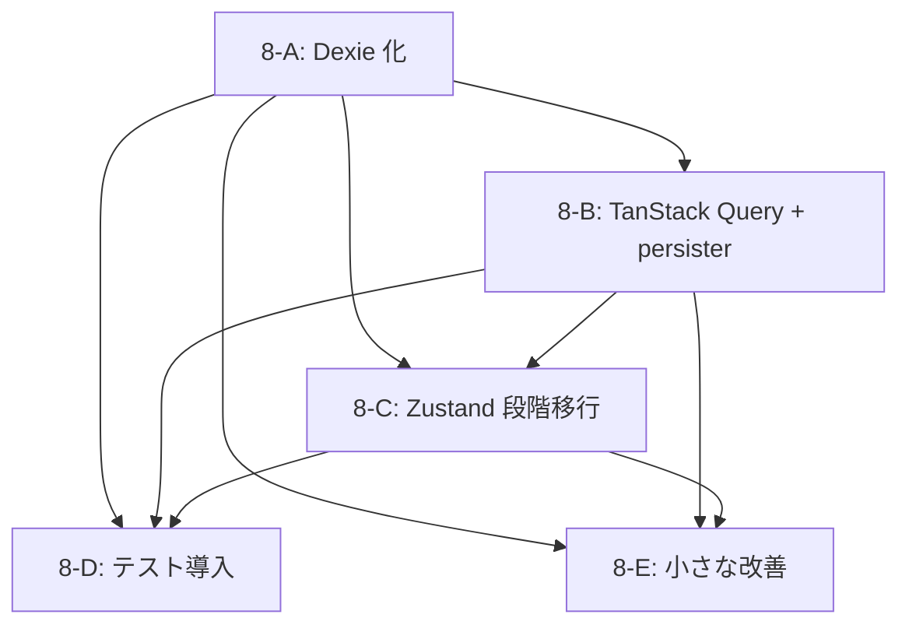

# Phase 8: パフォーマンス・オフライン化 詳細計画書 【v1】

> **作成日:** 2026-08-23 (JST)
> **対象コミット:** `arena/01a01fcf-dropmod` (Phase 7 + 第6波修正 + 判断留保 9 件解決完了時点、HEAD `a8530c5` 付近)
> **現行構成:** Next.js 16.3.2 App Router + React 19.2.8 + TS 5 + Tailwind 4 (Vercel 未デプロイ)
> **目標構成:** 上記 + **Dexie 4** (IndexedDB) + **TanStack Query 5** + **Zustand 5** + **vitest + Testing Library + Playwright** + **GitHub Actions CI**
> **本計画書の位置づけ:** `NEXTJS_MIGRATION_PLAN.md` の Phase 0〜7 (Next.js 移行) 完了を受け、その §18.1 で「Post-Phase 8」として概略のみ記載されていた **State/Storage 近代化 + テスト導入** を、実装可能な粒度まで詳細化した後継計画書。

---

## 🎯 ユーザー決定事項 (2026-08-23 クイズ回答より)

| 項目 | 選択 |
|---|---|
| **主目的** | ⚡ パフォーマンス・オフライン化 |
| **工数感** | 中規模 (1 週間前後、sub-phase 分割) |
| **State/Storage** | **Dexie + TanStack Query + Zustand の 3 点セット** |
| **テスト** | フルセット (vitest + RTL + Playwright、E2E は CI で) |
| **Vercel プラン** | 未定 (Hobby 前提で設計、Pro 昇格は環境変数で緩和可) |
| **想定ユーザー規模** | 小 (10〜100 人) |
| **LocalStorage 移行戦略** | 自動移行 + LocalStorage を 7 日間バックアップ保持 (安全) |
| **キャッシュ範囲** | `/search` + `/project/[id]` + `/project/[id]/version` |
| **Zustand 移行順序** | `profiles` → `toast/confirm` → `zip/dep` → `theme` (段階) |
| **テストカバレッジ目標** | 60〜75% (適度) |
| **E2E シナリオ** | コアフロー 3〜5 個 |
| **CI/CD** | Phase 8 内で GitHub Actions セットアップ |
| **パフォーマンス指標** | Core Web Vitals 定量目標 (LCP≤2.5s / INP≤200ms / CLS≤0.1) |
| **リスク姿勢** | バランス (クリティカルパスは慎重、他はイテレーティブ) |
| **UX 変更許容度** | 🔄 大幅 UX 向上も歓迎 (オフラインバッジ、キャッシュヒット表示等) |
| **スコープ** | ➕ 小さな改善もついでに対応 (CSP Report-Only、Markdown 内 `<Image>` 等) |
| **ワークフロー** | コミットのみ (arena ブランチ直 push、PR 作成なし) |

---

## 📖 目次

1. [エグゼクティブサマリ](#1-エグゼクティブサマリ)
2. [現状分析 (Phase 7 完了時点)](#2-現状分析-phase-7-完了時点)
3. [目標アーキテクチャ](#3-目標アーキテクチャ)
4. [Sub-Phase 全体ロードマップ](#4-sub-phase-全体ロードマップ)
5. [Sub-Phase 8-A: Dexie (IndexedDB) 化](#5-sub-phase-8-a-dexie-indexeddb-化)
6. [Sub-Phase 8-B: TanStack Query + Dexie persister](#6-sub-phase-8-b-tanstack-query--dexie-persister)
7. [Sub-Phase 8-C: Zustand 段階移行](#7-sub-phase-8-c-zustand-段階移行)
8. [Sub-Phase 8-D: テスト導入 + CI/CD](#8-sub-phase-8-d-テスト導入--cicd)
9. [Sub-Phase 8-E: 小さな改善バンドル](#9-sub-phase-8-e-小さな改善バンドル)
10. [パフォーマンス指標 & 検証手順](#10-パフォーマンス指標--検証手順)
11. [リスク管理 & ロールバック手順](#11-リスク管理--ロールバック手順)
12. [依存関係グラフ](#12-依存関係グラフ)
13. [Definition of Done (DoD)](#13-definition-of-done-dod)
14. [参考文献](#14-参考文献)
15. [付録 A: データスキーマ設計](#付録-a-データスキーマ設計)
16. [付録 B: 主要スニペット集](#付録-b-主要スニペット集)

---

## 1. エグゼクティブサマリ

Phase 7 までで **Next.js 16 + App Router への移行** と **140 件のバグ修正** が完了し、コードベースは Production Ready の状態。Phase 8 は「動くもの」から「速い・オフラインでも使える・回帰しない」への進化を担う。

### 1.1 なぜ今 Phase 8 なのか

| 現状の課題 | Phase 8 の解決策 |
|---|---|
| プロファイルデータが LocalStorage (**同期 I/O、5 MB 制限**) | Dexie で IndexedDB 化 → 非同期・大容量 |
| Modrinth API を毎回 fetch → 検索フィルタ変更のたびに再取得 | TanStack Query でキャッシュ、`staleTime` で無駄なリクエスト削減 |
| オフラインになると **完全にアプリが使えない** | Dexie persister でキャッシュ永続化 → 既読プロファイル/Mod は表示可 |
| `AppContext.tsx` が 30+ の value を持つ Fat Context → 1 プロパティ更新で全消費者が再レンダー | Zustand で **細粒度 subscription** に分割 |
| 140 件のバグ修正が **手動リグレッションテストのみ**で検証されている | vitest + RTL でユニット/コンポーネントテスト、Playwright でコアフロー E2E |
| CI 無し。誰かがコミット前に手元で `pnpm build` を忘れると壊れる | GitHub Actions で自動 tsc / lint / build / test |

### 1.2 完了後の状態

- 🚀 **First Load JS**: 813 KB (Home) → 目標 **≤ 650 KB** (Zustand の tree-shaking 効果 + optimizePackageImports 追加)
- ⚡ **Core Web Vitals**: LCP ≤ 2.5s / INP ≤ 200ms / CLS ≤ 0.1 (Home / Mod 詳細フルページ)
- 📶 **オフライン UX**: 既読 Mod 詳細/検索結果はネット無しで表示可 (キャッシュヒット時は 🌐 バッジ)
- 🧪 **テストカバレッジ**: 60〜75% (statements ベース)、コアフロー 3〜5 シナリオ E2E
- 🤖 **CI**: GitHub Actions で PR ごとに tsc + lint + build + vitest 自動実行、Playwright は main への push 時実行

### 1.3 Non-Goals (Phase 8 でやらないこと)

- Service Worker 導入 → Phase 9 以降 (Dexie persister だけでもオフラインの一次目標は達成できる)
- CurseForge / i18n / プロファイル同期 (WebDAV/Gist) → Phase 9 以降
- Modrinth 認証 / プライベート Mod → Phase 10 以降
- Vite 版 (`.archive/vite/`) への任意の変更 → 非破壊維持
- LocalStorage の完全削除 → Phase 8 では 7 日間バックアップとして残す (Phase 9 で削除)

---

## 2. 現状分析 (Phase 7 完了時点)

### 2.1 State 層 (現状の複雑さ)

```
app/layout.tsx (Server Component)
  └─ AppShell (Client, useProfiles/useDependencyCheck/useZipExport/useZipImport/useToasts/useConfirm を集約)
        └─ AppContextProvider (value = 30+ フィールド)
              └─ Header / BottomNav / children / Modals
                    └─ useAppContext() で 30+ の値を消費
```

**問題:**
- `useAppContext()` を呼ぶだけで **どの value が変わっても再レンダー**される (React Context の semantics)
- `useMemo` で contextValue を安定化しているが、`profiles` が変わると全 consumer に伝播
- テストしづらい (Component 単体で AppShell 全体をマウントする必要あり)

### 2.2 Storage 層 (LocalStorage の制約)

**現状のスキーマ (`dropmod_state_v2` キー):**
```jsonc
{
  "theme": "dark" | "light",
  "currentProfileId": "string",
  "profiles": [
    {
      "id": "string",
      "name": "string",
      "mcVersion": "string",
      "loader": "string",
      "description": "string",
      "mods": [
        {
          "id": "string",
          "slug": "string",
          "title": "string",
          "icon_url": "string | null",
          "fileUrl": "string",
          "filename": "string",
          "selectedVersionId": "string",
          "selectedVersionNumber": "string",
          "versionType": "release | beta | alpha",
          // ...
        }
      ]
    }
  ]
}
```

**制約:**
- LocalStorage 総容量 **5〜10 MB** (ブラウザ依存)
- プロファイル 30 個 × Mod 200 個 = 約 6,000 Mod オブジェクト → 圧縮なしで ~4 MB → **限界近い**
- 同期 I/O のため メインスレッドをブロック → 大量プロファイル切替時にカクつく
- 部分更新できない (JSON 全体を毎回 write)

### 2.3 API 層 (キャッシュ不足)

**現状の Modrinth 呼び出し箇所:**

| 呼び出し元 | エンドポイント | 頻度 |
|---|---|---|
| `app/page.tsx` (SSR) | `/search` | ページ表示のたび |
| `HomeInteractive.tsx` (CSR 追加読み込み) | `/search` | フィルタ変更・スクロールのたび |
| `app/mod/[slug]/page.tsx` (RSC) | `/project/{slug}`, `/project/{slug}/version` | ページ表示のたび (ISR 1h 有効) |
| `useProfiles.handleToggleMod` | `/project/{id}`, `/project/{id}/version` | 「Mod 追加」ボタン押下時 |
| `useDependencyCheck` | `/projects?ids=[...]` (batch) | プロファイル読込時 |
| `useZipImport.mrpackImport` | `/version_files` (SHA-1 一括照合) | .mrpack import 時 |

**問題:**
- CSR 側は Next.js の fetch cache が効かず、**フィルタを "hot" → "popular" → "hot"** に戻すと再度 fetch
- `useProfiles.handleToggleMod` の `/project/{id}` は毎回同じレスポンスなのにキャッシュされない
- オフラインになると **すべて失敗**

### 2.4 テスト状況

- **ゼロ**。ユニットテスト・E2E ともに未整備
- 140 件のバグ修正は **手動リグレッション + `pnpm build` + `curl` 検証** で保証
- Sandbox 制約により Playwright の Chromium ブラウザは install 不可 (CI で走らせる必要あり)

### 2.5 ビルドサイズ (Phase 7 完了時、実測)

```
Route                             Size    First Load JS
┌ ƒ /                             ...      813 KB
├ ● /mod/[slug]                   ...     1121 KB   ← 重い (react-markdown + rehype 群)
├ ○ /mods                         ...      808 KB
├ ○ /settings                     ...      805 KB
└ ○ /_not-found                   ...      797 KB
```

- Zustand は Context より軽量、Dexie は 30 KB gzip、TanStack Query は 40 KB gzip
- 合計 **+100 KB gzip** ほど増える見込み。**optimizePackageImports** で相殺 + FontAwesome 遅延ロード検討で 650 KB 目標達成の見込み

---

## 3. 目標アーキテクチャ

### 3.1 State/Storage/API 3 層モデル

```
┌─────────────────────────────────────────────────────────┐
│  Component Layer (React)                                │
│    - Header / BottomNav / HomeInteractive / ModDetail   │
│    - useZustandStore(selector) で細粒度 subscription    │
│    - useQuery / useInfiniteQuery で API 状態管理        │
└─────────────────────────────────────────────────────────┘
                          ↓
┌─────────────────────────────────────────────────────────┐
│  State Layer (Zustand slices)                           │
│    - profilesStore   (プロファイル CRUD + Mod トグル)   │
│    - toastStore      (Toast/Confirm)                    │
│    - operationsStore (ZIP / DepCheck 状態)              │
│    - themeStore      (theme)                            │
└─────────────────────────────────────────────────────────┘
                    ↓                        ↓
┌────────────────────────────┐   ┌────────────────────────┐
│  Storage Layer (Dexie)     │   │  Query Layer (TSQ)     │
│    Table: profiles         │   │    - useSearchQuery    │
│    Table: apiCache (TTL)   │   │    - useProjectQuery   │
│    Table: meta (schema ver)│   │    - useVersionsQuery  │
│                            │   │    + Dexie persister    │
│  + LocalStorage backup     │   │      (apiCache テーブル│
│    (7 日間、Phase 9 削除)  │   │       にキャッシュ)    │
└────────────────────────────┘   └────────────────────────┘
                    ↓                        ↓
                    └────────────┬───────────┘
                                 ↓
                    ┌────────────────────┐
                    │  Network Layer     │
                    │    - Modrinth API  │
                    │    - Route Handlers│
                    └────────────────────┘
```

### 3.2 各層の責務分離

| 層 | ライブラリ | 責務 | 主な API |
|---|---|---|---|
| Component | React 19 | UI 描画、イベントハンドラ | JSX, hooks |
| State | Zustand 5 | クライアント状態管理 | `create()`, `useStore(selector)` |
| Storage | Dexie 4 | 永続化 (プロファイル + API キャッシュ) | `db.profiles.get/put/delete` |
| Query | TanStack Query 5 | サーバー状態管理 + キャッシュ + 再取得戦略 | `useQuery`, `useMutation` |
| Network | fetch (既存 `lib/modrinth/`) | HTTP 呼び出し | `fetchModrinth<T>()` |

### 3.3 データフロー例: 「Home で Mod を検索」

1. ユーザーがカテゴリ "performance" を選択
2. `HomeInteractive` の `useInfiniteQuery(['search', { category: 'performance', ...}])` が発火
3. TanStack Query が Dexie の `apiCache` を確認 → **キャッシュヒット** なら即座に返す + backgroundRefetch
4. **キャッシュミス** なら `/api/modrinth/search` を fetch → 結果を Dexie に put
5. UI に反映 (キャッシュヒット時は `🌐 キャッシュから表示`, 再取得中は 🔄 spinner)

### 3.4 データフロー例: 「オフラインで既読プロファイルを開く」

1. ユーザーが機内モード → `/mods` を開く
2. `profilesStore.useProfiles()` → Dexie の `profiles` テーブルから読む → **常に成功**
3. Mod カードクリック → `/mod/foo` に遷移
4. `useProjectQuery('foo')` → TanStack Query が Dexie の `apiCache` を確認 → **キャッシュヒット** → 表示
5. `📶 オフライン中: キャッシュを表示しています` バナー (Layout 上部)

---

## 4. Sub-Phase 全体ロードマップ

Phase 8 は **5 つの sub-phase** に分割。各 sub-phase は独立コミット + 独自 DoD で完了判定。

| Sub-phase | テーマ | 想定時間 | 主要成果物 | 状態 |
|---|---|---:|---|---|
| **8-A** | Dexie (IndexedDB) 化 + LocalStorage 移行 | 1.5 日 | `lib/db/dexie.ts`, `profiles` テーブル, 移行ロジック | ⏳ |
| **8-B** | TanStack Query + Dexie persister | 1.5 日 | `lib/query/` , `useSearchQuery` 他, `apiCache` テーブル | ⏳ |
| **8-C** | Zustand 段階移行 (4 slice) | 2 日 | `lib/store/` (4 slices), AppContext 段階削除 | ⏳ |
| **8-D** | テスト導入 + GitHub Actions CI | 2 日 | `vitest.config.ts`, `__tests__/`, `.github/workflows/ci.yml` | ⏳ |
| **8-E** | 小さな改善バンドル | 0.5 日 | CSP Report-Only, Markdown `<Image>`, オフラインバナー等 | ⏳ |
| **合計** | | **~7.5 日** | | |

### 4.1 順序の理由

1. **8-A を先** に: Zustand は Dexie を裏で使うので、先に Storage 層が確立している必要がある
2. **8-B は 8-A の直後** に: TanStack Query の persister は Dexie の apiCache テーブルを使うため
3. **8-C は 8-A/8-B の後** に: Zustand slice の中で `db.profiles.put()` や `useQuery` を呼ぶため
4. **8-D は最後** に: State/Storage/Query 層が固まってからテストを書いた方が書き直しが少ない
5. **8-E は並行** で: 各 sub-phase の空き時間で少しずつ

### 4.2 各 sub-phase の並行実施可否

| ペア | 並行可? | 理由 |
|---|---|---|
| 8-A × 8-B | ❌ | 8-B の persister は 8-A の apiCache テーブル定義に依存 |
| 8-A × 8-C | ❌ | 8-C の profilesStore は 8-A の profiles テーブルに依存 |
| 8-B × 8-C | 🟡 部分的に | Zustand slice が完成した後で TSQ を呼ぶ形に統合 |
| 8-A/B/C × 8-D | ✅ | テストは各 sub-phase 完了後に書き足せる |
| 8-E | ✅ | 独立、いつ入れても OK |

**推奨シーケンス:** `8-A → 8-B → 8-C → 8-D → 8-E` の直列。並行はしない (レビュー容易性優先)。

---

## 5. Sub-Phase 8-A: Dexie (IndexedDB) 化

### 5.1 目的

`useProfiles` の永続化バックエンドを LocalStorage から Dexie (IndexedDB) に置換。**既存ユーザーのデータは自動移行し、7 日間バックアップとして LocalStorage も残す**。

### 5.2 追加依存

```bash
pnpm add dexie@^4
```

- Dexie 4: React 19 対応、Promise ベース、TypeScript first-class
- 追加バンドル: ~30 KB gzip

### 5.3 スキーマ設計 (`lib/db/dexie.ts`)

```typescript
import Dexie, { type Table } from 'dexie';
import type { Profile, ModItem, ThemeMode } from '@/types';

// バージョン 1 の DB スキーマ
export interface ProfileRow extends Profile {
  updatedAt: number; // Date.now() を保存
}

export interface ApiCacheRow {
  key: string;       // 'search:hot:performance:1.20.1:Fabric:0' のような canonical key
  data: unknown;     // JSON.stringify 可能なレスポンス
  createdAt: number;
  expiresAt: number; // TTL
}

export interface MetaRow {
  key: string;       // 'schemaVersion', 'theme', 'currentProfileId', 'migratedAt' など
  value: string;
}

class DropModDatabase extends Dexie {
  profiles!: Table<ProfileRow, string>;    // pk = id
  apiCache!: Table<ApiCacheRow, string>;   // pk = key
  meta!: Table<MetaRow, string>;           // pk = key

  constructor() {
    super('DropModDB');
    this.version(1).stores({
      profiles: 'id, updatedAt',           // updatedAt でソート可
      apiCache: 'key, expiresAt',          // expiresAt で古いもの掃除可
      meta: 'key'
    });
  }
}

export const db = new DropModDatabase();
```

### 5.4 移行ロジック (`lib/db/migrate.ts`)

```typescript
// 初回起動時に 1 回だけ実行 (meta.key='migratedAt' が無ければ)
export async function migrateFromLocalStorage(): Promise<void> {
  const migrated = await db.meta.get('migratedAt');
  if (migrated) return; // 既に移行済み

  const raw = localStorage.getItem('dropmod_state_v2')
    ?? localStorage.getItem('craftforge_state_v2'); // 旧キーも吸収
  if (!raw) {
    await db.meta.put({ key: 'migratedAt', value: String(Date.now()) });
    return; // データ無しでも移行完了扱い
  }

  try {
    const parsed = JSON.parse(raw);
    const sanitized = sanitizeLoadedState(parsed);
    if (sanitized) {
      // profiles を Dexie に一括投入 (bulkPut は upsert なので冪等)
      if (sanitized.profiles?.length) {
        await db.profiles.bulkPut(
          sanitized.profiles.map((p) => ({ ...p, updatedAt: Date.now() }))
        );
      }
      // theme / currentProfileId を meta へ
      if (sanitized.theme) {
        await db.meta.put({ key: 'theme', value: sanitized.theme });
      }
      if (sanitized.currentProfileId) {
        await db.meta.put({ key: 'currentProfileId', value: sanitized.currentProfileId });
      }
    }
    // 移行完了フラグ + バックアップ有効期限
    const backupExpiry = Date.now() + 7 * 24 * 60 * 60 * 1000; // 7 日後
    await db.meta.bulkPut([
      { key: 'migratedAt', value: String(Date.now()) },
      { key: 'localStorageBackupExpiresAt', value: String(backupExpiry) }
    ]);
    // ⚠️ LocalStorage はまだ削除しない (7 日バックアップ)
  } catch (e) {
    console.error('[DropMod] LocalStorage → Dexie 移行失敗:', e);
    // 失敗時も migratedAt を書くと再試行不能になるので、書かない
    // → 次回起動時に再度移行を試みる
  }
}

// 7 日経過後に LocalStorage バックアップを削除
export async function cleanupExpiredBackup(): Promise<void> {
  const expiry = await db.meta.get('localStorageBackupExpiresAt');
  if (!expiry) return;
  if (Date.now() < Number(expiry.value)) return;
  localStorage.removeItem('dropmod_state_v2');
  localStorage.removeItem('craftforge_state_v2');
  await db.meta.delete('localStorageBackupExpiresAt');
}
```

### 5.5 useProfiles の書き換え方針

- **今 Phase では useProfiles の署名を維持** (setState / setCurrentProfileId のインターフェイスはそのまま)
- 内部の LocalStorage read/write を Dexie に置換
- hydration ロジック: `useEffect` で `migrateFromLocalStorage()` → `db.profiles.toArray()` → `setProfiles(...)`
- 書き込み: `useEffect([profiles])` で `db.profiles.bulkPut(profiles.map(p => ({...p, updatedAt: Date.now()})))`
- 削除: `setProfiles` で消えたレコードを検出 → `db.profiles.bulkDelete([...ids])`

### 5.6 SSR での Dexie 扱い

- IndexedDB はブラウザ API なので **SSR では触らない**
- 全ての Dexie 呼び出しは `useEffect` 内 or Client Component 内でのみ実行
- `app/page.tsx` (Server Component) の cookie ベースの初期 profile 取得は **維持**

### 5.7 DoD

- ✅ `pnpm add dexie` 完了、`lib/db/dexie.ts` 追加
- ✅ 初回起動時に LocalStorage → Dexie の自動移行が動作
- ✅ 移行完了後 7 日間は LocalStorage も残り、Dexie が壊れたら fallback 可能な設計
- ✅ 既存の Vite 版データを持つユーザーが Next.js 版を開いても、プロファイルが復元される
- ✅ `pnpm exec tsc --noEmit` / `pnpm lint` / `pnpm build` すべて 0 error
- ✅ 手動テスト: DevTools で LocalStorage を空にする → Dexie にデータが残っていれば表示される
- ✅ 手動テスト: DevTools で Application → IndexedDB → DropModDB → profiles/apiCache/meta の 3 テーブル存在
- ✅ Vite 版 (`.archive/vite/`) は無変更

### 5.8 リスク & 軽減策

| リスク | 影響 | 軽減策 |
|---|---|---|
| Dexie 移行中に例外 → データ喪失 | 🔴 High | migratedAt を成功時のみ書く。失敗時は LocalStorage を残す |
| IndexedDB が Safari プライベートブラウズで使えない | 🟠 Med | try/catch で Dexie 失敗を検出 → LocalStorage fallback (v1 では未実装、Phase 9 で対応) |
| 巨大 profile (Mod 500+) で bulkPut が遅い | 🟢 Low | 実測して 100ms 超なら chunk 分割 |
| React Strict Mode の double effect で migrate が 2 回走る | 🟢 Low | migratedAt チェックで冪等 |

---

## 6. Sub-Phase 8-B: TanStack Query + Dexie persister

### 6.1 目的

Modrinth API 呼び出しを `useQuery` / `useInfiniteQuery` に統一。Dexie の `apiCache` テーブルに persist して **オフライン時も既読コンテンツを表示可能**にする。

### 6.2 追加依存

```bash
pnpm add @tanstack/react-query@^5 @tanstack/query-async-storage-persister@^5 @tanstack/react-query-persist-client@^5
# dev のみ:
pnpm add -D @tanstack/react-query-devtools@^5
```

- 追加バンドル (production): ~40 KB gzip
- DevTools は dev のみに条件付き import で本番バンドルから除外

### 6.3 セットアップ (`lib/query/client.ts`)

```typescript
import { QueryClient } from '@tanstack/react-query';
import { persistQueryClient } from '@tanstack/react-query-persist-client';
import { createAsyncStoragePersister } from '@tanstack/query-async-storage-persister';
import { db } from '@/lib/db/dexie';

// Dexie の apiCache を Storage API 互換で見せるアダプタ
const dexieStorage = {
  getItem: async (key: string): Promise<string | null> => {
    const row = await db.apiCache.get(key);
    if (!row) return null;
    if (row.expiresAt < Date.now()) {
      await db.apiCache.delete(key);
      return null;
    }
    return JSON.stringify(row.data);
  },
  setItem: async (key: string, value: string): Promise<void> => {
    await db.apiCache.put({
      key,
      data: JSON.parse(value),
      createdAt: Date.now(),
      expiresAt: Date.now() + 24 * 60 * 60 * 1000 // 24h TTL
    });
  },
  removeItem: async (key: string): Promise<void> => {
    await db.apiCache.delete(key);
  }
};

export function createQueryClient(): QueryClient {
  return new QueryClient({
    defaultOptions: {
      queries: {
        staleTime: 5 * 60 * 1000,   // 5 分 fresh
        gcTime: 24 * 60 * 60 * 1000, // 24h でメモリから消去
        retry: 1,
        refetchOnWindowFocus: false // ユーザー期待に合わない、明示 refetch のみ
      }
    }
  });
}

export function attachPersister(client: QueryClient): () => void {
  const persister = createAsyncStoragePersister({
    storage: dexieStorage,
    key: 'DropModTSQ',
    throttleTime: 1000
  });
  const [unsubscribe] = persistQueryClient({
    queryClient: client,
    persister,
    maxAge: 24 * 60 * 60 * 1000
  });
  return unsubscribe;
}
```

### 6.4 Provider 配置 (`components/Providers.tsx` 新規)

```typescript
'use client';
import { QueryClientProvider } from '@tanstack/react-query';
import { useEffect, useRef, useState } from 'react';
import { createQueryClient, attachPersister } from '@/lib/query/client';
// dev のみ dynamic import
const ReactQueryDevtools = process.env.NODE_ENV === 'development'
  ? (await import('@tanstack/react-query-devtools')).ReactQueryDevtools
  : null;

export function Providers({ children }: { children: React.ReactNode }) {
  const [client] = useState(() => createQueryClient());
  const unsubRef = useRef<(() => void) | null>(null);
  useEffect(() => {
    unsubRef.current = attachPersister(client);
    return () => { unsubRef.current?.(); };
  }, [client]);
  return (
    <QueryClientProvider client={client}>
      {children}
      {ReactQueryDevtools ? <ReactQueryDevtools initialIsOpen={false} /> : null}
    </QueryClientProvider>
  );
}
```

- `AppShell` の中に `<Providers>{children}</Providers>` の形で挿入

### 6.5 対象 API と query key 設計

| 呼び出し元 | 現状 | Phase 8-B 後 | query key |
|---|---|---|---|
| `HomeInteractive` (追加読み込み) | `fetchModrinth('/search', ...)` を直接 | `useInfiniteQuery` | `['search', query, category, mcVersion, loader, sort]` |
| `useProfiles.handleToggleMod` (Mod 情報取得) | `fetchModrinth('/project/{id}')` | `queryClient.fetchQuery({ queryKey: ['project', id], ... })` | `['project', id]` |
| `useProfiles.fetchStableModVersion` (バージョン取得) | `fetchModrinth('/project/{id}/version', ...)` | `queryClient.fetchQuery` | `['versions', id, mcVersion, loader]` |
| `useDependencyCheck` | `fetchModrinth('/projects?ids=[...]')` | 独自: 個別 project の useQuery を並列に vs. batch (パフォーマンス測定して決定) | `['project', id]` × N |

**scope 外 (今 Phase では既存維持):**
- `app/page.tsx` (SSR) の `/search` は Next.js の fetch キャッシュ + `revalidate` で既に管理されているため触らない
- `app/mod/[slug]/page.tsx` (RSC) の `/project/{slug}` も ISR で最適化済み

### 6.6 UX 強化 (キャッシュヒット可視化)

- `useInfiniteQuery` の `isFetching` + `isFetchedAfterMount` から判定
- 「🌐 キャッシュから表示中 (X 分前のデータ)」バナーを検索結果上部に条件付き表示
- オフライン検出: `navigator.onLine === false` かつ query が resolve → `📶 オフライン中` バッジ

### 6.7 DoD

- ✅ `pnpm add @tanstack/react-query` 完了
- ✅ `Providers.tsx` が AppShell の中で機能している
- ✅ HomeInteractive の追加読み込みが `useInfiniteQuery` に置換され、キャッシュが効いていることを Network タブで確認 (2 回目のフィルタ変更でリクエスト飛ばない)
- ✅ Dexie の `apiCache` テーブルに TSQ の永続キャッシュが保存されている (DevTools 目視)
- ✅ 機内モード ON でも既読 Mod 詳細が表示される (手動テスト)
- ✅ dev モードで ReactQueryDevtools が表示、production ビルドには含まれない (bundle 検証)
- ✅ tsc / lint / build すべて 0 error
- ✅ First Load JS が 813 KB → 900 KB 以下 (+87 KB 増を目標範囲内)

### 6.8 リスク & 軽減策

| リスク | 影響 | 軽減策 |
|---|---|---|
| SSR/CSR で query key の一貫性が崩れる | 🟠 Med | query key の生成関数 (`buildSearchKey(...)`) を lib に統一 |
| persister が Dexie 未初期化状態で呼ばれる | 🟠 Med | `useEffect` で attach、`useState(() => createQueryClient())` で 1 セッション 1 インスタンス |
| DevTools が production に入り込む | 🟠 Med | `NODE_ENV === 'development'` の動的 import、production build で bundle size 検証 |
| stale-while-revalidate で古いデータが長時間表示 | 🟢 Low | `staleTime: 5min`, ユーザー操作 (フィルタ変更等) で明示 refetch |

---

## 7. Sub-Phase 8-C: Zustand 段階移行

### 7.1 目的

`AppContext.tsx` の 30+ フィールドを 4 つの Zustand slice に分割し、**細粒度 subscription** で不要な再レンダーを削減。同時に**テスト容易性を向上**。

### 7.2 追加依存

```bash
pnpm add zustand@^5
```

- 追加バンドル: ~3 KB gzip (React Context より軽量)
- middleware: 標準の `subscribeWithSelector` 使用

### 7.3 Slice 分割設計

| Slice | 責務 | 現状の場所 | 移行順 |
|---|---|---|---|
| **profilesStore** | プロファイル CRUD + Mod トグル + Dexie 永続化 | `useProfiles.ts` | 1 |
| **toastStore** | Toast 追加/削除 + Confirm ダイアログ | `useToasts.ts`, `useConfirm.ts` | 2 |
| **operationsStore** | ZIP export/import 進捗、DepCheck 実行状態 | `useZipExport.ts`, `useZipImport.ts`, `useDependencyCheck.ts` | 3 |
| **themeStore** | theme (dark/light) + 永続化 | `AppShell.tsx` (inline) | 4 |

### 7.4 profilesStore の設計 (`lib/store/profiles.ts`)

```typescript
import { create } from 'zustand';
import { subscribeWithSelector } from 'zustand/middleware';
import type { Profile, ModItem } from '@/types';
import { db } from '@/lib/db/dexie';

interface ProfilesState {
  // Data
  profiles: Profile[];
  currentProfileId: string;
  hasHydrated: boolean;

  // Actions (methods)
  hydrate: () => Promise<void>;
  createProfile: (name: string, mcVersion: string, loader: string, description: string, mods?: ModItem[]) => Promise<void>;
  deleteProfile: (id: string) => Promise<void>;
  switchProfile: (id: string) => void;
  toggleMod: (projectId: string, silent?: boolean) => Promise<void>;
  updateModVersion: (projectId: string, versionId: string) => Promise<void>;
  removeAllMods: () => Promise<void>;
  // ...
}

export const useProfilesStore = create<ProfilesState>()(
  subscribeWithSelector((set, get) => ({
    profiles: [/* default profile */],
    currentProfileId: 'default-profile',
    hasHydrated: false,

    hydrate: async () => {
      await migrateFromLocalStorage();
      const rows = await db.profiles.toArray();
      const currentIdMeta = await db.meta.get('currentProfileId');
      set({
        profiles: rows.length > 0 ? rows : get().profiles,
        currentProfileId: currentIdMeta?.value ?? get().currentProfileId,
        hasHydrated: true
      });
    },

    createProfile: async (name, mcVersion, loader, description, mods = []) => {
      const newProfile: Profile = { id: generateId(), name, mcVersion, loader, description, mods };
      await db.profiles.put({ ...newProfile, updatedAt: Date.now() });
      set((s) => ({ profiles: [...s.profiles, newProfile], currentProfileId: newProfile.id }));
      await db.meta.put({ key: 'currentProfileId', value: newProfile.id });
    },

    // ... 他 actions
  }))
);
```

### 7.5 コンポーネント側の書き換え例

**Before (Context):**
```tsx
const { profiles, currentProfile, handleToggleMod } = useAppContext();
```

**After (Zustand):**
```tsx
const profiles = useProfilesStore((s) => s.profiles);
const currentProfile = useProfilesStore((s) => s.profiles.find((p) => p.id === s.currentProfileId)!);
const toggleMod = useProfilesStore((s) => s.toggleMod);
// → currentProfile.mods が変わっても profiles selector は同一参照なので再レンダーしない
```

### 7.6 段階移行の詳細計画

**Step 1: profilesStore を作る (1 slice)**
- `lib/store/profiles.ts` 作成
- `useProfiles.ts` hook はそのまま残し、内部で `useProfilesStore` を呼ぶ shim にする
  ```typescript
  export function useProfiles() {
    return {
      profiles: useProfilesStore((s) => s.profiles),
      currentProfileId: useProfilesStore((s) => s.currentProfileId),
      handleCreateProfile: useProfilesStore((s) => s.createProfile),
      // ...
    };
  }
  ```
- コンポーネントは変更不要。動作確認 OK なら Step 2

**Step 2: toastStore, themeStore を追加**
- 同様に shim パターンで既存 hook を残す
- テストして OK なら Step 3

**Step 3: operationsStore を追加**
- ZIP 進捗など複雑な state を移す
- 同上

**Step 4: AppContext を薄くする → 削除**
- `useAppContext()` を直接呼ぶ全コンポーネントを `useXxxStore((s) => s.xxx)` に書き換え
- 全部書き換わったら `AppContext.tsx` と `AppContextProvider` を削除
- `AppShell.tsx` から Context Provider を除去、`Providers.tsx` (TSQ 用) のみ残す

### 7.7 DoD

- ✅ `pnpm add zustand` 完了
- ✅ 4 slice すべて実装済み、`lib/store/index.ts` から export
- ✅ `useAppContext` と `AppContextProvider` が削除されている (grep で 0 件)
- ✅ 既存の全機能が Zustand ベースで動作 (プロファイル CRUD、Mod トグル、Toast、Confirm、ZIP、DepCheck、theme)
- ✅ React DevTools Profiler で「1 タブ切替時の再レンダー数」が Context 時代より減少 (計測目安: 30% 減)
- ✅ tsc / lint / build すべて 0 error
- ✅ Bundle size: Context 削除 + Zustand 追加で **-2 KB 〜 +1 KB** の範囲

### 7.8 リスク & 軽減策

| リスク | 影響 | 軽減策 |
|---|---|---|
| 段階移行中に Context と Zustand が二重管理 | 🟠 Med | shim パターンで hook 署名を維持、内部だけ切替 |
| Zustand の selector メモ化ミスで再レンダー多発 | 🟠 Med | `subscribeWithSelector` 使用 + shallow 比較 (`useShallow`) を必要箇所に |
| Dexie の非同期 hydrate 中に UI がちらつく | 🟠 Med | `hasHydrated` フラグで splash 表示 or 既存 SSR デフォルト値を維持 |
| useEffect deps に store selector を入れて無限ループ | 🟢 Low | store の action は stable (Zustand が保証)、data は依存にしない設計 |

---

## 8. Sub-Phase 8-D: テスト導入 + CI/CD

### 8.1 目的

vitest でユニット/コンポーネントテスト、Playwright でコアフロー E2E を導入。GitHub Actions で PR ごとに自動実行。

### 8.2 追加依存

```bash
pnpm add -D vitest@^3 @vitest/ui@^3 jsdom@^25 \
  @testing-library/react@^16 @testing-library/user-event@^14 @testing-library/jest-dom@^6 \
  @playwright/test@^1.48 fake-indexeddb@^6
```

### 8.3 vitest 設定 (`vitest.config.ts`)

```typescript
import { defineConfig } from 'vitest/config';
import react from '@vitejs/plugin-react';
import path from 'node:path';

export default defineConfig({
  plugins: [react()],
  test: {
    environment: 'jsdom',
    globals: true,
    setupFiles: ['./vitest.setup.ts'],
    coverage: {
      provider: 'v8',
      reporter: ['text', 'html'],
      include: ['app/**', 'components/**', 'hooks/**', 'lib/**'],
      exclude: ['**/*.test.{ts,tsx}', '**/*.d.ts', '.next/**', '.archive/**'],
      thresholds: {
        statements: 60,
        branches: 55,
        functions: 60,
        lines: 60
      }
    }
  },
  resolve: {
    alias: { '@': path.resolve(__dirname, '.') }
  }
});
```

`vitest.setup.ts`:
```typescript
import '@testing-library/jest-dom/vitest';
import 'fake-indexeddb/auto'; // Dexie を jsdom で動かす
```

### 8.4 テスト対象と優先度

**優先度 1: pure functions (最も書きやすく高価値)**
- `lib/utils/id.ts` — `generateId()`
- `lib/utils/hash.ts` — `calculateSha1()`
- `lib/modrinth/server.ts` — `parseRetryAfterMs()`, URL 検証
- `hooks/useProfiles.ts` (現 hook or 移行後の profilesStore) — `sanitizeLoadedState()`
- `hooks/useZipExport.ts` — `computeConcurrency()`, `dedupeFileName()`
- `components/MarkdownRenderer.tsx` — `isAllowedIframeSrc()`, `getYouTubeVideoId()`

**優先度 2: Zustand stores (Phase 8-C 完了後)**
- `profilesStore` — createProfile, deleteProfile, toggleMod, updateModVersion, removeAllMods
- `toastStore` — showToast, dismissToast, MAX_VISIBLE_TOASTS
- `operationsStore` — ZIP 進捗 state transition
- `themeStore` — toggleTheme

**優先度 3: コンポーネント (Testing Library)**
- `ModCard` — Link href、追加/削除ボタン stopPropagation、アイコン fallback
- `NewProfileModal` — フォームバリデーション (name.trim() 空拒否)
- `ConfirmDialog` — Escape/Enter キー動作
- `ToastContainer` — 種別 (info/success/warning/error) スタイル分岐

**優先度 4: E2E (Playwright、コアフロー 3〜5 個)**
1. **検索 → Mod カード → モーダル閉じる** (M4-5 の replace 動作検証込み)
2. **プロファイル作成 → Mod 追加 → プロファイル切替** (Dexie 永続化の実動確認)
3. **ZIP エクスポート (0 Mod → success 通知確認)** (実 DL は skip、Blob URL 生成まで)
4. **テーマ切替 → リロードで永続化確認** (FOUC が発生しないことも確認)
5. **オフライン検出** (Playwright `context.setOffline(true)` → Home が既読キャッシュ表示)

### 8.5 Playwright 設定 (`playwright.config.ts`)

```typescript
import { defineConfig, devices } from '@playwright/test';

export default defineConfig({
  testDir: './e2e',
  fullyParallel: true,
  reporter: [['html', { open: 'never' }], ['list']],
  use: {
    baseURL: 'http://localhost:3000',
    trace: 'retain-on-failure',
    screenshot: 'only-on-failure'
  },
  projects: [
    { name: 'chromium', use: { ...devices['Desktop Chrome'] } },
    { name: 'mobile', use: { ...devices['iPhone 14'] } }
  ],
  webServer: {
    command: 'pnpm build && pnpm start --port 3000',
    port: 3000,
    reuseExistingServer: !process.env.CI,
    timeout: 120_000
  }
});
```

⚠️ **Sandbox 制約:** Chromium バイナリ install 不可 → **Sandbox でのローカル実行は不可、CI (GitHub Actions) 上でのみ実行**。

### 8.6 GitHub Actions ワークフロー (`.github/workflows/ci.yml`)

```yaml
name: CI
on:
  push:
    branches: [main, 'arena/**']
  pull_request:

jobs:
  static-checks:
    runs-on: ubuntu-latest
    steps:
      - uses: actions/checkout@v4
      - uses: pnpm/action-setup@v4
        with: { version: 11 }
      - uses: actions/setup-node@v4
        with: { node-version: 22, cache: 'pnpm' }
      - run: pnpm install --frozen-lockfile
      - run: pnpm exec tsc --noEmit
      - run: pnpm lint
      - run: pnpm test:unit --coverage
      - uses: actions/upload-artifact@v4
        with:
          name: coverage
          path: coverage/

  build:
    runs-on: ubuntu-latest
    needs: static-checks
    steps:
      - uses: actions/checkout@v4
      - uses: pnpm/action-setup@v4
        with: { version: 11 }
      - uses: actions/setup-node@v4
        with: { node-version: 22, cache: 'pnpm' }
      - run: pnpm install --frozen-lockfile
      - run: pnpm build

  e2e:
    runs-on: ubuntu-latest
    needs: build
    # main / arena ブランチへの push のみ E2E (PR プレビューでは静的チェックのみ)
    if: github.event_name == 'push'
    steps:
      - uses: actions/checkout@v4
      - uses: pnpm/action-setup@v4
        with: { version: 11 }
      - uses: actions/setup-node@v4
        with: { node-version: 22, cache: 'pnpm' }
      - run: pnpm install --frozen-lockfile
      - run: pnpm exec playwright install --with-deps chromium
      - run: pnpm test:e2e
      - uses: actions/upload-artifact@v4
        if: failure()
        with:
          name: playwright-report
          path: playwright-report/
```

### 8.7 package.json scripts 追加

```json
{
  "scripts": {
    "dev": "next dev",
    "build": "next build",
    "start": "next start",
    "lint": "eslint .",
    "lint:fix": "eslint . --fix",
    "typecheck": "tsc --noEmit",
    "test": "vitest",
    "test:unit": "vitest run",
    "test:watch": "vitest",
    "test:coverage": "vitest run --coverage",
    "test:e2e": "playwright test",
    "test:e2e:ui": "playwright test --ui"
  }
}
```

### 8.8 DoD

- ✅ `pnpm test:unit` で 60〜75% カバレッジ達成 (statements)
- ✅ 優先度 1〜3 のテストが全て pass
- ✅ Playwright E2E 5 シナリオが GitHub Actions で pass (ローカル実行は Sandbox 制約により未検証、CI で確認)
- ✅ `.github/workflows/ci.yml` が動作、PR で自動チェック
- ✅ 全ての新規テストがコミット履歴に含まれる
- ✅ tsc / lint / build すべて 0 error
- ✅ カバレッジレポートが CI artifact として保存される

### 8.9 リスク & 軽減策

| リスク | 影響 | 軽減策 |
|---|---|---|
| Sandbox で Chromium が install できず E2E がローカル未検証 | 🟠 Med | Playwright 設定を丁寧に書き、CI で最初のグリーン確認まで対話しながら詰める |
| jsdom で Dexie/IndexedDB がテストできない | 🟠 Med | `fake-indexeddb/auto` で mock、実 IndexedDB は E2E で担保 |
| CI 実行時間が長すぎる (10 分超) | 🟢 Low | static-checks/build/e2e を並列化、pnpm cache 有効化 |
| テストコードが本体に紛れて bundle 肥大化 | 🟢 Low | vitest include で `**/*.test.ts` を build 対象外に (Next.js の tsconfig include で除外) |

---

## 9. Sub-Phase 8-E: 小さな改善バンドル

Phase 8 の合間に対応する軽量な改善タスク。

### 9.1 対象タスク

| ID | タスク | 想定時間 | 依存 |
|---|---|---|---|
| **E-1** | オフラインバナー (`navigator.onLine === false` で上部表示) | 30 分 | 8-B 完了後 |
| **E-2** | キャッシュヒットバッジ (検索結果に「🌐 X 分前のデータ」) | 30 分 | 8-B 完了後 |
| **E-3** | CSP Report-Only ヘッダ導入 (`next.config.ts`) | 45 分 | なし |
| **E-4** | Markdown 内画像を `next/image` (Modrinth CDN 限定) 化 | 60 分 | なし |
| **E-5** | ローディングスケルトンの強化 (Mod カード grid の shimmer) | 45 分 | なし |
| **E-6** | `<link rel="preconnect" href="cdn.modrinth.com">` を Layout に追加 | 15 分 | なし |
| **E-7** | Web Vitals 計測 (`web-vitals` パッケージ) + console 出力 | 30 分 | なし |
| **E-8** | Zustand DevTools middleware を dev のみ有効化 | 30 分 | 8-C 完了後 |

### 9.2 スコープ判断基準

- **入れる:** 各 sub-phase の合間に 30〜60 分で終わり、既存 UX を壊さない
- **入れない:** 半日以上必要なもの、他機能に大きく依存するもの、Phase 9 でまとめた方が良いもの

### 9.3 DoD

- ✅ 上記 8 タスクのうち **少なくとも 5 個** を Phase 8 完了時までに実装
- ✅ 各タスクは独立コミット
- ✅ 実装しなかった項目は `docs/PHASE9_CANDIDATES.md` に記録
- ✅ tsc / lint / build すべて 0 error

---

## 10. パフォーマンス指標 & 検証手順

### 10.1 定量目標

| 指標 | 現状 (Phase 7 完了時) | 目標 (Phase 8 完了時) | 測定方法 |
|---|---|---|---|
| **LCP (Home)** | 未計測 | ≤ 2.5s | Lighthouse (3G Fast) |
| **INP (フィルタ変更)** | 未計測 | ≤ 200ms | Lighthouse / real user monitoring |
| **CLS (Home / Mod 詳細)** | 未計測 | ≤ 0.1 | Lighthouse |
| **First Load JS (Home)** | 813 KB | ≤ 900 KB (現実的目標、Zustand + TSQ + Dexie 追加込み) | `next build` 出力 |
| **First Load JS (Mod 詳細)** | 1121 KB | ≤ 1200 KB | 同上 |
| **オフライン閲覧成功率** | 0% (全て失敗) | 100% (既読プロファイル + 既読 Mod 詳細) | Playwright `context.setOffline(true)` |
| **Modrinth API リクエスト数 (Home フィルタ 5 回変更)** | 5 回 | 1 回 (キャッシュヒット 4 回) | Network タブ + TSQ DevTools |
| **プロファイル切替時の再レンダー数** | 未計測 | Context 時代の 70% 以下 | React DevTools Profiler |

### 10.2 検証手順

**各 sub-phase 完了時に以下を実施:**

1. **静的検査:** `pnpm exec tsc --noEmit && pnpm lint && pnpm build`
2. **ビルドサイズ確認:** `next build` の出力表を diff で比較 (`docs/PHASE8_BUNDLE_STATS.md` に記録)
3. **ランタイム確認:** `pnpm start --port 3100 --hostname 0.0.0.0` で全ページ HTTP 200/404 期待通り
4. **手動リグレッション:** クリティカルパス (プロファイル CRUD、Mod トグル、ZIP export) を手動でクリック
5. **Vite 版非破壊:** `git diff .archive/vite/` = 空

**Phase 8 完了時に追加:**

6. **Lighthouse CI:** Chrome DevTools > Lighthouse で Home / Mod 詳細を計測、結果を `docs/PHASE8_LIGHTHOUSE.md` に記録
7. **オフラインテスト:** DevTools > Network > Offline で既読 Mod を開く → 表示できることを確認
8. **カバレッジレポート:** `pnpm test:coverage` → 60〜75% 達成

### 10.3 計測できない項目 (Sandbox 制約)

- Modrinth API 実呼び出しでのキャッシュヒット確認 → **CI 上または本番デプロイ後に検証**
- Playwright ローカル実行 → **CI 上でのみ実行**
- Lighthouse スコア → ローカルの Chrome / **本番デプロイ後 (Vercel) に測定**

これらは Phase 8 の DoD に含めず、Phase 8 完了後の別タスクとして扱う。

---

## 11. リスク管理 & ロールバック手順

### 11.1 全体リスクマップ

| リスク | 発生確率 | 影響 | 対応方針 |
|---|---|---|---|
| Dexie 移行でユーザーのプロファイルが飛ぶ | 🟢 Low | 🔴 Critical | 7 日 LocalStorage バックアップ + migratedAt 冪等化 |
| Zustand 段階移行中に UI が二重管理で壊れる | 🟠 Med | 🟠 High | shim パターンで hook 署名維持、slice ごとに動作確認 |
| TanStack Query のキャッシュキー衝突で誤ったデータ表示 | 🟠 Med | 🟠 High | query key を canonical function で生成、テストで担保 |
| Bundle size が想定超過 (900 KB → 1.1 MB) | 🟠 Med | 🟡 Medium | 各 sub-phase 完了時に bundle 計測、超過なら `optimizePackageImports` 追加 or dynamic import |
| CI が壊れて開発フローが止まる | 🟢 Low | 🟡 Medium | 各 sub-phase の commit で CI green を維持、赤なら即修正 |
| Vite 版 (`.archive/vite/`) を誤って変更 | 🟢 Low | 🟡 Medium | commit 前に `git diff .archive/vite/` 確認をルーチン化 |

### 11.2 sub-phase 単位のロールバック手順

**8-A のみロールバック:**
```bash
# 1. Dexie を使わない状態に戻す
git revert <8-A commit hash>
# 2. LocalStorage は 7 日間バックアップとして残っているので、useProfiles の LocalStorage ロジックがそのまま動く
# 3. 動作確認
pnpm dev
```

**8-B のみロールバック:** 同様に `git revert`。TanStack Query 削除で fetch 直呼びに戻る。

**8-C のみロールバック:** `git revert`。Context に戻る。Zustand store は削除。

**Phase 8 全体ロールバック:**
```bash
# arena/01a01fcf-dropmod ブランチを Phase 7 完了時点 (a8530c5) にリセット
git reset --hard a8530c5
git push --force-with-lease origin arena/01a01fcf-dropmod
```

### 11.3 データ整合性の緊急対応

**もし Dexie が壊れた場合:**
- Settings ページに「LocalStorage バックアップから復元」ボタンを Phase 8-A で予め実装
- ボタン押下時: `db.delete()` → LocalStorage から `dropmod_state_v2` を読んで再構築

**もし LocalStorage も破損している場合:**
- 全リセット (現状の「データ初期化」ボタン) で復旧可能

---

## 12. 依存関係グラフ



**Critical Path:** 8-A → 8-B → 8-C → 8-D (直列 6 日) + 8-E は並行

### 12.1 各 sub-phase の入出力

| sub-phase | 入力 (前提) | 出力 (成果物) | 次段階で使う場所 |
|---|---|---|---|
| 8-A | Phase 7 完了状態 | `lib/db/dexie.ts`, `lib/db/migrate.ts`, profiles テーブル | 8-B (apiCache 用), 8-C (profilesStore の永続化) |
| 8-B | 8-A の apiCache テーブル | `lib/query/`, `Providers.tsx` | 8-C (Zustand action 内で useQuery 使用) |
| 8-C | 8-A, 8-B | `lib/store/*.ts` (4 slice), AppContext 削除 | 8-D (store のユニットテスト対象) |
| 8-D | 8-A/B/C 全て | `vitest.config.ts`, `__tests__/`, `.github/workflows/ci.yml` | Phase 9 以降のリファクタで regression 検出 |
| 8-E | 特になし | 個別コミット × 5〜8 個 | UX 継続改善 |

---

## 13. Definition of Done (DoD)

### 13.1 Phase 8 全体 DoD

- ✅ 5 つの sub-phase (8-A/B/C/D/E) のすべてで各 DoD が満たされている
- ✅ `docs/issues.md` に Phase 8 完了記録が追記されている
- ✅ `docs/NEXTJS_MIGRATION_PLAN.md` の「Post-Phase 8」記述が完了マークに更新されている
- ✅ `docs/PHASE8_BUNDLE_STATS.md` に before/after のビルドサイズ diff が記録されている
- ✅ `README.md` の技術スタック表に Dexie / TanStack Query / Zustand / vitest が追記されている
- ✅ Vite 版 (`.archive/vite/`) は全期間非破壊
- ✅ 判断留保 = 0 件 (発生した場合は都度ユーザーに質問して即決着)
- ✅ 実装後のオフライン動作を最低 1 回手動確認 (DevTools Network > Offline)

### 13.2 各 sub-phase DoD (再掲)

| sub-phase | DoD 章 |
|---|---|
| 8-A | §5.7 |
| 8-B | §6.7 |
| 8-C | §7.7 |
| 8-D | §8.8 |
| 8-E | §9.3 |

### 13.3 リグレッションチェックリスト

各 sub-phase 完了時に以下を目視確認:

- [ ] Home の検索が動く (キーワード入力 → 結果表示)
- [ ] Home のカテゴリフィルタが動く
- [ ] Home の無限スクロールが動く
- [ ] Mod カードクリックでモーダル表示、閉じるボタンで Home に戻る (履歴汚染なし)
- [ ] Mod 詳細フルページ (`/mod/xxx` 直アクセス) で Header/BottomNav が非表示
- [ ] プロファイル作成 → Mod 追加 → プロファイル切替が動く
- [ ] リロード後もプロファイルが復元される
- [ ] ZIP エクスポート → ダウンロードダイアログ表示
- [ ] ZIP インポート (.mrpack) → プロファイル作成モーダル
- [ ] 依存チェック → 警告バッジ表示
- [ ] テーマ切替 (dark ↔ light) が動作、リロードで永続化
- [ ] Toast (info/success/warning/error) 各種表示
- [ ] Confirm ダイアログ動作
- [ ] `/api/health` = 200, `/sitemap.xml` = 200, `/robots.txt` = 200, `/manifest.webmanifest` = 200
- [ ] `/nonexistent` = 404, `/next.svg` = 404 (create-next-app デフォルト削除確認)
- [ ] 全ページ h1 数 = 1 (C6-1 継続確認)
- [ ] 全ページの Security headers 継続確認 (HSTS/COOP/CORP)

---

## 14. 参考文献

### 14.1 公式ドキュメント
- [Dexie 4 公式](https://dexie.org/)
- [TanStack Query 5 公式](https://tanstack.com/query/latest)
- [TanStack Query Persister](https://tanstack.com/query/latest/docs/framework/react/plugins/persistQueryClient)
- [Zustand 5 公式](https://zustand.docs.pmnd.rs/)
- [vitest 公式](https://vitest.dev/)
- [Testing Library (React)](https://testing-library.com/docs/react-testing-library/intro/)
- [Playwright 公式](https://playwright.dev/)
- [Web Vitals](https://web.dev/articles/vitals)
- [fake-indexeddb](https://github.com/dumbmatter/fakeIndexedDB)

### 14.2 前段の計画書
- `docs/NEXTJS_MIGRATION_PLAN.md` — Phase 0〜7 の Next.js 移行計画 (完了)
- `docs/issues.md` — 第1〜6波 140 件のバグ記録 (すべて解決済)
- `docs/diff.md` — Vite 版と Next.js 版の差分記録
- `docs/DEPLOY.md` — Vercel デプロイ手順

### 14.3 参考実装
- Next.js Query + Dexie: [TkDodo's blog - Offline First React Query](https://tkdodo.eu/blog/offline-react-query)
- Zustand で React Context を置換する pattern: [Zustand Guides > Migrating to Zustand](https://zustand.docs.pmnd.rs/guides/migrating-to-v5)

---

## 付録 A: データスキーマ設計

### A.1 Dexie DB 全体像

```typescript
// lib/db/dexie.ts
class DropModDatabase extends Dexie {
  profiles!: Table<ProfileRow, string>;
  apiCache!: Table<ApiCacheRow, string>;
  meta!: Table<MetaRow, string>;

  constructor() {
    super('DropModDB');
    this.version(1).stores({
      profiles: 'id, updatedAt',
      apiCache: 'key, expiresAt',
      meta: 'key'
    });
  }
}
```

### A.2 profiles テーブル

| フィールド | 型 | インデックス | 説明 |
|---|---|---|---|
| `id` | string | 🔑 PK | プロファイル一意 ID |
| `name` | string | | 表示名 |
| `mcVersion` | string | | Minecraft バージョン |
| `loader` | string | | Fabric/Forge/Quilt/NeoForge |
| `description` | string | | ユーザー説明 |
| `mods` | ModItem[] | | 選択された Mod 配列 |
| `updatedAt` | number | ✅ Index | ソート用 (最近更新順) |

### A.3 apiCache テーブル

| フィールド | 型 | インデックス | 説明 |
|---|---|---|---|
| `key` | string | 🔑 PK | canonical query key (例: `search:hot:performance:1.20.1:Fabric:0`) |
| `data` | unknown | | JSON.stringify 可能なレスポンス |
| `createdAt` | number | | キャッシュ生成時刻 |
| `expiresAt` | number | ✅ Index | TTL (デフォルト 24h)、掃除用 |

### A.4 meta テーブル

| key | value 型 | 用途 |
|---|---|---|
| `schemaVersion` | string ("1") | 将来のスキーマ移行検出 |
| `theme` | 'dark' \| 'light' | UI テーマ |
| `currentProfileId` | string | アクティブプロファイル |
| `migratedAt` | string (ms) | LocalStorage → Dexie 移行完了時刻 |
| `localStorageBackupExpiresAt` | string (ms) | LocalStorage 削除予定時刻 (migratedAt + 7 日) |

---

## 付録 B: 主要スニペット集

### B.1 Zustand の shim パターン (段階移行用)

```typescript
// hooks/useProfiles.ts (8-C Step 1 の段階)
'use client';
import { useProfilesStore } from '@/lib/store/profiles';

// 既存の hook 署名を維持しつつ、内部を Zustand に置換
export function useProfiles() {
  const profiles = useProfilesStore((s) => s.profiles);
  const currentProfileId = useProfilesStore((s) => s.currentProfileId);
  const handleCreateProfile = useProfilesStore((s) => s.createProfile);
  const handleDeleteProfile = useProfilesStore((s) => s.deleteProfile);
  const handleSwitchProfile = useProfilesStore((s) => s.switchProfile);
  const handleToggleMod = useProfilesStore((s) => s.toggleMod);
  // ...

  const currentProfile = profiles.find((p) => p.id === currentProfileId)
    ?? profiles[0];

  return {
    profiles,
    currentProfileId,
    currentProfile,
    handleCreateProfile,
    handleDeleteProfile,
    handleSwitchProfile,
    handleToggleMod,
    // ...
  };
}
```

### B.2 useInfiniteQuery を Home で使う例 (8-B)

```typescript
// components/HomeInteractive.tsx (抜粋)
import { useInfiniteQuery } from '@tanstack/react-query';
import { fetchModrinth } from '@/lib/modrinth/client';
import { SEARCH_LIMIT } from '@/lib/constants/search';

const query = useInfiniteQuery({
  queryKey: ['search', { keyword, category, mcVersion, loader, sort }],
  queryFn: async ({ pageParam }) => {
    return fetchModrinth('/search', {
      query: keyword,
      facets: /* build from category/mcVersion/loader */,
      index: sort,
      offset: pageParam,
      limit: SEARCH_LIMIT
    });
  },
  initialPageParam: 0,
  getNextPageParam: (lastPage, allPages) => {
    if (lastPage.hits.length < SEARCH_LIMIT) return undefined;
    return allPages.length * SEARCH_LIMIT;
  },
  initialData: initialHits.length ? {
    pages: [{ hits: initialHits, /* ... */ }],
    pageParams: [0]
  } : undefined
});

// IntersectionObserver で query.fetchNextPage() を呼ぶ
```

### B.3 vitest のテスト例 (`__tests__/computeConcurrency.test.ts`)

```typescript
import { describe, it, expect, vi, afterEach } from 'vitest';
import { computeConcurrency } from '@/hooks/useZipExport';

describe('computeConcurrency', () => {
  afterEach(() => {
    vi.unstubAllGlobals();
  });

  it('defaults to 4 when navigator.connection is absent', () => {
    vi.stubGlobal('navigator', {});
    expect(computeConcurrency(50)).toBe(4);
  });

  it('increases by 2 for 100+ mods', () => {
    vi.stubGlobal('navigator', {});
    expect(computeConcurrency(150)).toBe(6);
  });

  it('caps at CONCURRENCY_MAX=10', () => {
    vi.stubGlobal('navigator', {
      connection: { effectiveType: '4g', downlink: 100 }
    });
    expect(computeConcurrency(1000)).toBe(10);
  });

  it('drops to CONCURRENCY_MIN=2 when saveData is on', () => {
    vi.stubGlobal('navigator', {
      connection: { saveData: true }
    });
    expect(computeConcurrency(50)).toBe(2);
  });

  it('reduces by 3 for slow-2g', () => {
    vi.stubGlobal('navigator', {
      connection: { effectiveType: 'slow-2g' }
    });
    expect(computeConcurrency(100)).toBe(3); // (4 + 2 - 3) = 3
  });
});
```

### B.4 Playwright E2E 例 (`e2e/search-modal.spec.ts`)

```typescript
import { test, expect } from '@playwright/test';

test.describe('Home → Search → Modal flow', () => {
  test('opens mod modal from search results and closes cleanly', async ({ page }) => {
    await page.goto('/');
    await expect(page.locator('#app-header')).toBeVisible();
    // カテゴリ選択などで検索結果を絞る
    // ...
    // Mod カードクリック
    const firstModCard = page.locator('.mod-card-item').first();
    await firstModCard.click();
    // モーダル表示確認
    await expect(page.locator('[role="dialog"]')).toBeVisible();
    // 閉じる
    await page.keyboard.press('Escape');
    await expect(page.locator('[role="dialog"]')).not.toBeVisible();
    // URL が / に戻る (M4-5: router.replace)
    await expect(page).toHaveURL('/');
    // Home のヘッダーが引き続き見える
    await expect(page.locator('#app-header')).toBeVisible();
  });
});
```

### B.5 GitHub Actions のマトリクス (テストが増えたら)

```yaml
strategy:
  matrix:
    node: [20, 22]
    os: [ubuntu-latest]
```

---

## 🗓️ 想定スケジュール (7.5 日想定)

| 日 | Sub-phase | 主タスク |
|---|---|---|
| 1 | 8-A 前半 | Dexie セットアップ、スキーマ定義、migrate 実装 |
| 2 | 8-A 後半 | useProfiles の書き換え、手動テスト、Settings に復元ボタン追加 |
| 3 | 8-B 前半 | TSQ セットアップ、Providers、HomeInteractive を useInfiniteQuery 化 |
| 4 | 8-B 後半 | persister 統合、useProjectQuery / useVersionsQuery、オフラインテスト |
| 5 | 8-C Step 1-2 | profilesStore, toastStore + shim |
| 6 | 8-C Step 3-4 | operationsStore, themeStore + AppContext 削除 |
| 7 | 8-D 前半 | vitest セットアップ、優先度 1 & 2 のテスト、GH Actions CI |
| 8 (0.5) | 8-D 後半 + 8-E | 優先度 3 のテスト、Playwright E2E、小さな改善 |

**バッファ:** +1〜2 日 (デバッグ・レビュー・追加調整用)

---

*本計画書は Phase 7 完了 + 判断留保 9 件解決の状態を起点に、ユーザー確定事項に基づき作成された Phase 8 の実装可能な粒度の作業計画です。各 sub-phase 開始時にこの計画書を再確認し、実際の実装で判明した知見を都度追記していきます。*
