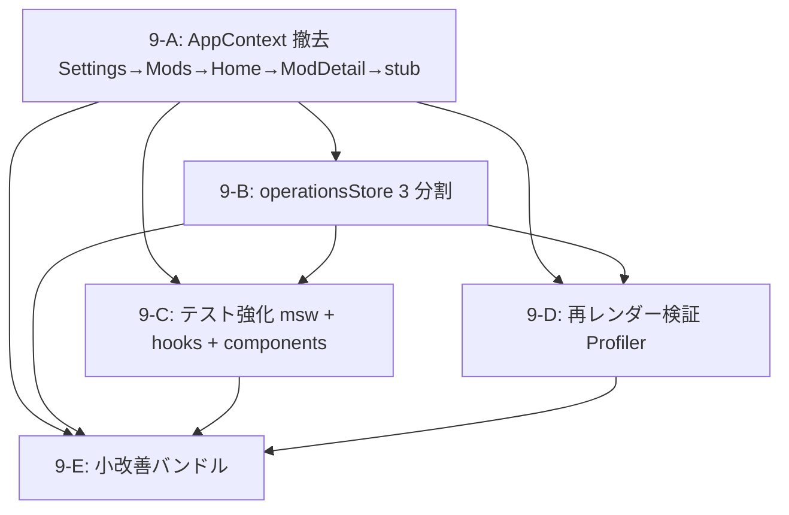

# Phase 9: テスト・品質強化 + アーキテクチャ青写し 詳細計画書 【v1】

> **作成日:** 2026-08-23 (JST)
> **対象コミット:** `arena/01a01fcf-dropmod` (Phase 8 完了 + 第7波修正完了時点、HEAD `3780f28`)
> **現行構成:** Next.js 16.3.2 + React 19.2.8 + TS 5 + Tailwind 4 + Dexie 4 + TanStack Query 5 + Zustand 5 + vitest 3
> **目標構成:** 上記 + **AppContext 完全撤去** + **operationsStore (zipExport/zipImport/depCheck 3 分割)** + **msw 2.15** + **カバレッジ per-module 目標達成**
> **本計画書の位置づけ:** `PHASE8_PLAN.md` の後継。Phase 8 完了レポート §Phase 9 推奨タスク、`diff/phase8.md` の未実装項目 (D2 AppContext 撤去 / D3 coverage 底上げ)、第7波 issues.md の中期対応項目を統合。

---

## 🎯 ユーザー決定事項 (2026-08-23 クイズ回答より)

| 項目 | 選択 |
|---|---|
| **主目的** | 🧪 テスト・品質強化 + 🏗️ アーキテクチャ青写し (2 本柱) |
| **工数感** | 中規模 (1 週間、sub-phase 分割) |
| **Bundle 削減** | ⏭️ 見送り (現状 960 KB で許容) |
| **AppContext 撤去** | ✅ 完全撤去 (コンポーネントごとに順次移行 → 最終 stub 化) |
| **Vercel 本番デプロイ** | ⏭️ 見送り (Phase 10 以降) |
| **テストカバレッジ** | ✅ hooks + components + Modrinth msw で **60%** 達成 |
| **AppContext 撤去順序** | 🔄 Settings → Mods → Home → ModDetail (段階、各ステップで検証) |
| **operationsStore** | 📚 3 slice 分割 (zipExport/zipImport/depCheck) |
| **Modrinth テスト手法** | ✅ **msw 2.15** (Mock Service Worker) |
| **コンポーネントテスト** | 🖥️ @testing-library/user-event 積極利用 |
| **カバレッジ目標** | 🎯 モジュール別 (lib/store 90%, hooks 70%, components 50%, lib/modrinth 65%) |
| **再レンダー検証** | 📊 React DevTools Profiler で実測 (Context 時代の 70% 以下) |
| **AppContext.tsx 最終形** | 🔍 **stub 化** (throw + pass-through、Phase 10 で完全削除) |
| **sub-phase 数** | 4 分割 + 小改善バンドル 1 (9-A/9-B/9-C/9-D/9-E) |
| **coverage threshold** | 📐 per-module 設定 (vitest 3 per-file thresholds) |
| **スコープ** | 🔓 小さな改善もついでに OK (E-2 キャッシュヒットバッジ、docs 更新等) |
| **CI コスト** | ✅ **$0** (public repo で GitHub Actions 無制限) |
| **Storybook** | ⏭️ 導入しない (小規模個人開発、維持コスト過大) |
| **ワークフロー** | commit only (arena ブランチ直 push、PR 作成なし) |

---

## 📖 目次

1. [エグゼクティブサマリ](#1-エグゼクティブサマリ)
2. [現状分析 (Phase 8 + 第7波修正完了時点)](#2-現状分析-phase-8--第7波修正完了時点)
3. [目標アーキテクチャ](#3-目標アーキテクチャ)
4. [Sub-Phase 全体ロードマップ](#4-sub-phase-全体ロードマップ)
5. [Sub-Phase 9-A: AppContext 撤去 + Zustand 直接参照化](#5-sub-phase-9-a-appcontext-撤去--zustand-直接参照化)
6. [Sub-Phase 9-B: operationsStore 3 分割](#6-sub-phase-9-b-operationsstore-3-分割)
7. [Sub-Phase 9-C: テスト強化 (msw + hooks + components)](#7-sub-phase-9-c-テスト強化-msw--hooks--components)
8. [Sub-Phase 9-D: 再レンダー検証](#8-sub-phase-9-d-再レンダー検証)
9. [Sub-Phase 9-E: 小改善バンドル](#9-sub-phase-9-e-小改善バンドル)
10. [パフォーマンス指標 & 検証手順](#10-パフォーマンス指標--検証手順)
11. [リスク管理 & ロールバック](#11-リスク管理--ロールバック)
12. [依存関係グラフ](#12-依存関係グラフ)
13. [Definition of Done (DoD)](#13-definition-of-done-dod)
14. [Non-Goals (Phase 9 でやらないこと)](#14-non-goals-phase-9-でやらないこと)
15. [参考文献](#15-参考文献)
16. [付録 A: AppContext stub の実装形](#付録-a-appcontext-stub-の実装形)
17. [付録 B: msw ハンドラー設計例](#付録-b-msw-ハンドラー設計例)
18. [付録 C: per-module coverage threshold 設定](#付録-c-per-module-coverage-threshold-設定)
19. [付録 D: 再レンダー Profiler 測定手順](#付録-d-再レンダー-profiler-測定手順)

---

## 1. エグゼクティブサマリ

Phase 8 で **Dexie + TanStack Query + Zustand + テスト土台** を導入した。しかし以下の 2 つの積み残しがある:

1. **AppContext がまだ Fat (30+ フィールド)** — 4 コンポーネントが `useAppContext()` 経由で消費、`contextValue` の 1 フィールドでも変わると全 consumer が再レンダー
2. **テストカバレッジが 6%** — lib/store は 96% だが、hooks / components / Modrinth client は未テスト。回帰保証が薄い

Phase 9 はこの 2 点を集中的に解消する。副次目標として第7波の中期対応項目 (M7 系) の残と、Phase 8 の diff (D2/D3) の完全解消を含める。

### 1.1 なぜ今 Phase 9 なのか

| 現状の課題 | Phase 9 の解決策 |
|---|---|
| `useAppContext` が 30+ フィールド → 1 プロパティ更新で全 consumer 再レンダー | 各 hooks/components を Zustand store 直接参照に (細粒度 subscription) |
| ZIP export/import と DepCheck が hooks に閉じており、進捗が別コンポーネントから見えない | `useZipExportStore` / `useZipImportStore` / `useDepCheckStore` に分割 |
| カバレッジ 6% では PR ごとの regression 検出が実質できない | msw + user-event で hooks/components/Modrinth client を網羅、60% 達成 |
| 「再レンダー数減った」の主張が実測されていない | React DevTools Profiler で before/after を数値で証明 |
| CI ワークフローが `.github/workflows/` に置けず docs にある | Phase 9 でユーザー配置 + 実運用 |

### 1.2 完了後の状態

- 🏗️ **AppContext 撤去**: `useAppContext()` 呼び出し = 0、`AppContext.tsx` は stub のみ (Phase 10 で完全削除予定)
- 📚 **operationsStore 3 slice**: `useZipExportStore` / `useZipImportStore` / `useDepCheckStore`。既存 hooks はそれらの shim になる
- 🧪 **テストカバレッジ 60% 達成**: lib/store 90% / hooks 70% / components 50% / lib/modrinth 65% (per-module thresholds)
- 🔬 **msw 導入**: Modrinth API を network レベルで mock、テストが real fetch 経路と整合
- 📊 **再レンダー削減の実測記録**: `docs/PHASE9_PROFILER.md` に before/after 数値と screenshot
- 🌐 **オフライン UX 追加**: E-2 キャッシュヒットバッジ、docs アップデート

### 1.3 Non-Goals (Phase 9 でやらないこと)

- Bundle 削減 (FontAwesome 削減など) → Phase 10 以降
- Vercel 本番デプロイ → Phase 10 以降
- 新機能追加 (プロファイル同期、関連 Mod レコメンド、CurseForge 等) → Phase 10 以降
- Storybook 導入 → 見送り (小規模個人開発、維持コスト過大)
- CSP Report-Only → enforce モード切替 → Phase 10 以降 (違反レポート収集期間必要)
- カバレッジ 75%+ を目指す → Phase 10 以降 (今回は 60% 目標で現実的に)

---

## 2. 現状分析 (Phase 8 + 第7波修正完了時点)

### 2.1 State 層

```
app/layout.tsx (Server Component)
  └─ <QueryProviders> (PersistQueryClientProvider + Dexie persister)     ← Phase 8 追加
     └─ <AppShell> (Client Component)
        ├─ useProfiles (Zustand backed profilesStore + hooks 側 Modrinth 呼び出し)
        ├─ useToasts (Zustand backed toastStore shim)
        ├─ useConfirm (Zustand backed confirmStore + owner ID shim)  ← 第7波 L7-2 修正
        ├─ useZipExport (useState + useCallback、hooks 内完結)  ← Phase 9 で store 化
        ├─ useZipImport (useState + useCallback、hooks 内完結)  ← Phase 9 で store 化
        ├─ useDependencyCheck (useState + useCallback、hooks 内完結)  ← Phase 9 で store 化
        └─ <AppContextProvider value={contextValue}>  ← Phase 9 で削除
           └─ <Header/> <BottomNav/> children (HomeInteractive/ModDetail/ModsPage/Settings)
                └─ useAppContext() で 30+ 値を消費  ← Phase 9 で Zustand 直接参照に
```

**問題点:**
- `contextValue` は `useMemo` で安定化されているが、依存に profiles / theme / zip 進捗など多数を含むため、**1 つ変わると全 consumer 再レンダー**
- `useAppContext()` で `{ currentProfile, handleToggleMod }` のようにピンポイント取得しても、Context の性質上「Context 値全体が変わると再レンダー」
- Zustand の細粒度 subscription (`useStore(s => s.field)`) を活かせていない

### 2.2 テスト状況

Phase 8 完了時点の `pnpm test:coverage` 結果:

| 領域 | statements | 状況 |
|---|---|---|
| `lib/state/` (sanitize) | **100%** | 完全カバー |
| `lib/store/` (toast/confirm/profiles) | **96%** | ほぼ完全 |
| `lib/query/keys.ts` | **100%** | keys builder テスト済 |
| `lib/utils/hash.ts` | **91%** | SHA-1 vector テスト |
| `lib/utils/id.ts` | **62%** | prefix/uniqueness テスト |
| `lib/modrinth/` (client/server) | 一部 (parseRetryAfterMs のみ) | ⚠️ 大半未カバー |
| `lib/query/client.ts` / `hooks.ts` | **0%** | ⚠️ 完全未カバー |
| `lib/db/` (dexie/migrate) | **0%** | ⚠️ 未カバー (fake-indexeddb で書ける) |
| `hooks/` (useProfiles など) | **0-18%** | ⚠️ 未カバー (integration test 必要) |
| `components/` (OfflineBanner のみ) | 一部 | ⚠️ ほとんど未カバー |
| **全体** | **6.28%** | **60% 目標に遠い** |

### 2.3 現行 hooks の Zustand 化状況

| hook | 内部実装 | 用途 |
|---|---|---|
| `useProfiles` | Zustand backed + Modrinth API 呼び出し (`queryClient.fetchQuery`) | プロファイル CRUD + Mod トグル |
| `useToasts` | Zustand shim (`useToastStore`) | Toast 表示 |
| `useConfirm` | Zustand shim (`useConfirmStore`) + owner ID | 確認ダイアログ |
| `useZipExport` | useState + useCallback (Zustand 化未実施) | ZIP エクスポート進捗管理 |
| `useZipImport` | useState + useCallback (Zustand 化未実施) | .mrpack/.zip インポート |
| `useDependencyCheck` | useState + useCallback (Zustand 化未実施) | 依存チェック warning |
| `useModalA11y` | useEffect + useId (Zustand 化不要) | モーダル a11y |

**Phase 9 の 9-B 対象**: 上記 3 つ (`useZipExport/useZipImport/useDependencyCheck`) を Zustand slice 化。

### 2.4 CI 状況

- `docs/CI_WORKFLOW.yml` に完成された workflow はあるが、**未配置** (GitHub App 権限制約、`docs/CI_SETUP.md` に手順記載済)
- 実運用開始は「ユーザーが `.github/workflows/ci.yml` に配置」した後
- Playwright は Sandbox で Chromium install 不可 → CI 側でのみ実行

### 2.5 削除対象コード量 (見積り)

| ファイル | 削減想定 | 内容 |
|---|---|---|
| `components/AppContext.tsx` | 119 行 → ~50 行 (stub) | Fat Context の中身削除 |
| `components/AppShell.tsx` | -60 行 | `contextValue` useMemo (30 field) 削除 |
| `components/HomeInteractive.tsx` | ±5 行 | useAppContext → useProfilesStore 等に置換 |
| `components/ModDetailModalShell.tsx` | ±5 行 | 同上 |
| `components/ModsPageClient.tsx` | ±10 行 | 同上 (使う field が多い) |
| `components/SettingsPageClient.tsx` | ±10 行 | 同上 |
| **合計** | **~-140 行** | |

その一方で追加:
- `lib/store/zipExport.ts` (~150 行)
- `lib/store/zipImport.ts` (~200 行)
- `lib/store/depCheck.ts` (~80 行)
- `__tests__/mocks/{server,handlers}.ts` (~200 行)
- `__tests__/hooks/*.test.ts` × 4-5 個 (~600 行)
- `__tests__/components/*.test.tsx` × 5-6 個 (~500 行)
- `__tests__/lib/modrinth/*.test.ts` (~200 行)

**総コード量**: +1,800 行 (テスト中心)、-140 行 (実装)、実装ネット +200 行程度。

---

## 3. 目標アーキテクチャ

### 3.1 State 層 (Phase 9 完了後)

```
app/layout.tsx (Server Component)
  └─ <QueryProviders>
     └─ <AppShell> (Client Component、hooks/components 直接 Zustand 参照)
        ├─ useProfiles (Zustand backed profilesStore) — 変更なし
        ├─ useToasts (Zustand shim) — 変更なし
        ├─ useConfirm (Zustand shim) — 変更なし
        ├─ useZipExport (useZipExportStore shim) ← Phase 9-B 新規
        ├─ useZipImport (useZipImportStore shim) ← Phase 9-B 新規
        ├─ useDependencyCheck (useDepCheckStore shim) ← Phase 9-B 新規
        └─ children (Header/BottomNav/HomeInteractive/ModDetail/ModsPage/Settings)
                └─ 各コンポーネントが直接 useXxxStore((s) => s.field) で取得
                   → useAppContext() は完全に呼ばれない (Phase 9-A 完了時)
```

`<AppContextProvider>` は **stub の pass-through wrapper** として残るが、実質何もしない。Phase 10 で完全削除予定。

### 3.2 Zustand store の最終形

> **D14 更新 (Phase 9 実装時追加)**: Server → Client 関数 props 渡し不能問題への対応として
> `appActions.ts` を新設。7 store 構成に変更。

```
lib/store/
├── profiles.ts        (Phase 8-C step1、既存) — profiles + theme + updater ヘルパ
├── toast.ts           (Phase 8-C step2、既存) — toasts + showToast + dismissToast
├── confirm.ts         (Phase 8-C step2、既存 + 第7波 L7-2 修正) — confirm dialog + owner ID
├── zipExport.ts       (Phase 9-B 新規) — ZIP エクスポート進捗 + isOpen + cancel (cancelRequested / requestCancel / clearCancelRequest)
├── zipImport.ts       (Phase 9-B 新規) — pendingImportData のみ (isNewProfileModalOpen 等の Modal open state は AppShell 局所 useState として残置。D4)
├── depCheck.ts        (Phase 9-B 新規) — hasDepWarning + lastCheckAt + isChecking + reset (計画から reset() が追加、D7)
├── appActions.ts      (Phase 9-A 新規) — AppShell 由来 handleXxx 関数の登録/購読、Server → Client 境界を跨ぐため (D14)
└── useCurrentProfileWithFallback.ts (Phase 9-E 修正 B33 追加) — currentProfile 共通取得 hook
```

### 3.3 テスト構成 (Phase 9 完了後)

```
__tests__/
├── mocks/                                (Phase 9-C 新規)
│   ├── handlers.ts       — Modrinth API mock ハンドラー (search, project, version, projects, versions)
│   └── server.ts         — setupServer(...handlers) export
├── lib/
│   ├── state/sanitize.test.ts            (既存 10 tests)
│   ├── utils/{id,hash}.test.ts           (既存 9 tests)
│   ├── query/keys.test.ts                (既存 9 tests)
│   ├── store/{toast,confirm,profiles}.test.ts (既存 28 tests + owner ID 2 tests = 30 tests)
│   ├── store/{zipExport,zipImport,depCheck}.test.ts  ← Phase 9-B/C 新規
│   ├── modrinth/parseRetryAfterMs.test.ts (既存 7 tests)
│   ├── modrinth/{client,server}.test.ts   ← Phase 9-C 新規 (msw 経由)
│   ├── db/{dexie,migrate}.test.ts         ← Phase 9-C 新規 (fake-indexeddb)
│   └── query/hooks.test.tsx               ← Phase 9-C 新規 (D15 修正: client.ts は
│                                             SSR + IndexedDB adapter 依存で単体テスト困難、
│                                             vitest.config.ts で coverage exclude 済、E2E で担保)
├── hooks/
│   ├── computeConcurrency.test.ts        (既存 11 tests)
│   ├── useProfiles.test.tsx              ← Phase 9-C 新規 (integration)
│   ├── useZipExport.test.tsx             ← Phase 9-C 新規
│   ├── useZipImport.test.tsx             ← Phase 9-C 新規
│   └── useDependencyCheck.test.tsx       ← Phase 9-C 新規
├── components/
│   ├── OfflineBanner.test.tsx            (既存 4 tests)
│   ├── ModCard.test.tsx                  ← Phase 9-C 新規 (user-event)
│   ├── NewProfileModal.test.tsx          ← Phase 9-C 新規 (form validation)
│   ├── ConfirmDialog.test.tsx            ← Phase 9-C 新規 (Escape/Enter)
│   ├── Header.test.tsx                   ← Phase 9-C 新規 (theme toggle)
│   └── CustomDropdown.test.tsx           ← Phase 9-C 新規 (keyboard nav)
└── e2e/ (既存 5 spec files、Phase 9 では大きな変更なし)
```

---

## 4. Sub-Phase 全体ロードマップ

| Sub-phase | テーマ | 想定時間 | 主要成果物 | 依存 |
|---|---:|---|---|---|
| **9-A** | AppContext 撤去 | 2 日 | 4 コンポーネント Zustand 直接参照化、AppContext.tsx stub 化 | Phase 8-C 完了 |
| **9-B** | operationsStore 3 分割 | 1.5 日 | zipExport/zipImport/depCheck store + shim hooks | 9-A 完了 (推奨、独立でも可) |
| **9-C** | テスト強化 (msw + 各 hooks/components) | 2.5 日 | msw handlers/server、hooks/components/modrinth テスト、coverage 60% 達成 | 9-A/9-B 完了後 |
| **9-D** | 再レンダー検証 | 0.5 日 | `docs/PHASE9_PROFILER.md` (before/after 数値記録) | 9-A/9-B 完了後 |
| **9-E** | 小改善バンドル | 0.5 日 | E-2 キャッシュヒットバッジ、docs 更新、diff.md 反映 | 全体並行 |
| **合計** | | **~7 日** | | |

### 4.1 順序の理由

1. **9-A を先** に: AppContext 撤去で hooks/components がどの store から何を取っているか明確化。テスト側も store を直接扱う方が書きやすい
2. **9-B は 9-A の後** に: shim パターンで既存 useZipExport 等の hook 署名を維持しつつ内部を store 化。9-A で全 consumer が Zustand 直接参照になった後の方が、shim の破綻ケースを検出しやすい
3. **9-C は 9-A/B の後** に: テスト対象が固まってから書く方が書き直しゼロ
4. **9-D は 9-A/B 完了時に測定**: 実装が固まってから profiler 起動、Context 時代の記録と比較
5. **9-E は並行** で: 各 sub-phase の合間に少しずつ

### 4.2 並行実施可否

| ペア | 並行可? | 理由 |
|---|---|---|
| 9-A × 9-B | 🟡 部分的に | 9-B の operationsStore を先に作ってから 9-A で参照する形は可能。ただしレビュー容易性優先で直列推奨 |
| 9-A × 9-C | ❌ | 9-C のコンポーネントテストで useAppContext モックが必要になり無駄 |
| 9-B × 9-C | ❌ | 9-C の hooks integration test は 9-B の store を前提とする |
| 9-D | 9-A/B 完了後のみ | 測定対象が固まってないと意味なし |
| 9-E | ✅ 全体並行 | 独立、いつ挟んでも OK |

**推奨シーケンス:** `9-A → 9-B → 9-C → 9-D → 9-E (全体並行)` の直列。

---

## 5. Sub-Phase 9-A: AppContext 撤去 + Zustand 直接参照化

### 5.1 目的

`useAppContext()` を消費している 4 コンポーネントを Zustand store 直接参照に順次書き換え、最終的に AppContext.tsx を stub 化する。

### 5.2 撤去順序 (Settings → Mods → Home → ModDetail)

**理由:**
1. **Settings が最も少ない依存** (theme/handleResetData/showToast/confirm など 8 field) → 練習台に最適
2. **Mods は次に多い** (プロファイル一覧 + Mod トグル)
3. **Home が中規模** (currentProfile + プロファイル操作 + Mod トグル)
4. **ModDetail が最終** (currentProfile + handleToggleMod のみ、実は少ない)

各ステップで **単独動作確認** (build + runtime + 手動リグレッション) → OK なら次へ。

### 5.3 各コンポーネントの置換パターン

**Before (現状):**
```tsx
// components/SettingsPageClient.tsx
import { useAppContext } from './AppContext';

export const SettingsPageClient: React.FC = () => {
  const {
    theme, setTheme, handleDownloadZip, handleImportZipInput, handleDropZip,
    profiles, currentProfileId, handleSwitchProfile, openNewProfileModal,
    handleDeleteProfile, handleResetData, showToast, confirm
  } = useAppContext();
  // ...
};
```

**After (9-A 完了):**
```tsx
// components/SettingsPageClient.tsx
import { useProfilesStore } from '@/lib/store/profiles';
import { useToastStore } from '@/lib/store/toast';
import { useConfirmStore } from '@/lib/store/confirm';
import { useZipExportActions } from '@/lib/store/zipExport';  // 9-B の shim 経由でも可
// AppShell 側で defined される props も可 (openNewProfileModal 等は AppShell の局所 state)

export interface SettingsPageClientProps {
  handleResetData: () => void;
  handleDownloadZip: () => void;
  handleImportZipInput: (e: React.ChangeEvent<HTMLInputElement>) => void;
  handleDropZip: (e: React.DragEvent) => void;
  handleSwitchProfile: (id: string) => void;
  handleDeleteProfile: (id: string) => void | Promise<void>;
  openNewProfileModal: () => void;
}

export const SettingsPageClient: React.FC<SettingsPageClientProps> = (props) => {
  // 細粒度 subscription (theme が変わっても profiles 消費者は再レンダーしない)
  const theme = useProfilesStore((s) => s.theme);
  const setTheme = useProfilesStore((s) => s.setTheme);
  const profiles = useProfilesStore((s) => s.profiles);
  const currentProfileId = useProfilesStore((s) => s.currentProfileId);

  const showToast = useToastStore((s) => s.showToast);
  const confirm = useConfirmStore((s) => s.confirm);
  // ...
};
```

### 5.4 実装 Step 詳細

#### Step 9-A.1: SettingsPageClient (Day 1 前半)

1. **useAppContext から取得している field を洗い出し**
2. **Zustand store から取れるもの / props で受け取るものを分類**
   - Store: theme, setTheme, profiles, currentProfileId, showToast, confirm
   - Props (AppShell 局所 state 由来): handleResetData, handleDownloadZip, handleImportZipInput, handleDropZip, handleSwitchProfile, handleDeleteProfile, openNewProfileModal
3. **`SettingsPageClientProps` interface を定義**
4. **useAppContext の分割代入を Zustand selector + props に置換**
5. **AppShell 側で `<SettingsPageClient handleResetData={handleResetData} ... />` として props 渡し**
6. **build + runtime + 手動 (Settings 全操作) 確認**
7. **commit: `refactor(9-A.1): SettingsPageClient を Zustand + props 直接参照に (useAppContext 撤去)`**

#### Step 9-A.2: ModsPageClient (Day 1 後半)

同様のパターン。ModsPageClient は Mod 一覧 + Mod トグル + バージョン変更で store 参照が多い。

- Store: profiles, currentProfileId, handleToggleMod (useProfilesStore 経由)
- Props: currentProfile (selector で内部計算), mcVersions (AppShell の mcVersions state 由来), handleUpdateModVersion, handleRemoveAllMods, ...

commit: `refactor(9-A.2): ModsPageClient を Zustand + props 直接参照に`

#### Step 9-A.3: HomeInteractive (Day 2 前半)

Home は Hero パネル + 検索 + 無限スクロール。useAppContext から取っている field:
- Store: profiles, currentProfileId, handleToggleMod
- Props: currentProfile, openNewProfileModal, openEditProfileModal, openDependencyCheckModal (AppShell 局所)

commit: `refactor(9-A.3): HomeInteractive を Zustand + props 直接参照に`

#### Step 9-A.4: ModDetailModalShell (Day 2 後半)

一番シンプル (currentProfile + handleToggleMod のみ)。

commit: `refactor(9-A.4): ModDetailModalShell を Zustand + props 直接参照に`

#### Step 9-A.5: AppContext.tsx を stub 化 (Day 2 後半)

**この時点で `grep -rn 'useAppContext'` が 0 件になっているはず**を確認。

**stub 化の実装** (詳細は付録 A):
- `AppContextValue` → `Record<string, never>` に単純化 (型のみ残す、@deprecated JSDoc 付き)
- `useAppContext()` → **throw** 実装 (誤呼び出しを実行時に検出、Fail-Fast)
- `AppContextProvider` → `<>{children}</>` の pass-through (Runtime コスト実質ゼロ)

AppShell 側:
- `contextValue` の useMemo (約 60 行) を **削除**
- `<AppContextProvider value={contextValue}>` を `<AppContextProvider>` (value なし) に

commit: `refactor(9-A.5): AppContext を stub 化 (Phase 10 で完全削除予定)`

### 5.5 検証手順 (各 Step 完了時)

**必須リグレッションチェック (全 Step 共通):**
- [ ] `pnpm typecheck` (`tsconfig.json` + `tsconfig.test.json` 両方) = 0 error
- [ ] `pnpm lint` = 0 error / 0 warning
- [ ] `pnpm build` = ✓ Compiled successfully
- [ ] `pnpm test:unit` = 全 pass (Phase 8 完了時 80 tests + 9-C 追加分)
- [ ] `pnpm start` で対象ページ (Settings/Mods/Home/ModDetail) の全操作を手動確認
- [ ] Vite 版 (`.archive/vite/`) の `git diff` = 空

**Step 5 (stub 化) 特有:**
- [ ] `grep -rn 'useAppContext' --include='*.ts' --include='*.tsx' app/ components/ hooks/ lib/` = **0 件**
- [ ] `grep -rn 'AppContextValue' --include='*.ts' --include='*.tsx' app/ components/ hooks/ lib/` = **0 件** (except AppContext.tsx 内部)
- [ ] AppShell の `contextValue` useMemo が削除されている
- [ ] AppContext.tsx が `~80 行以下` に縮小 (D16 修正: §10.1 60 行と齟齬があった 50 行を統一。
      実装はコメントリッチで 73 行、Phase 10 で完全削除予定なので許容)

### 5.6 DoD

- ✅ `useAppContext` が全コンポーネントから呼ばれない (grep 0 件)
- ✅ `AppContext.tsx` が stub 実装 (throw + pass-through)
- ✅ 各 sub-step で build + runtime + 手動リグレッション pass
- ✅ Bundle: Home 963 KB → ± 5 KB (props 追加分微増、useMemo 削除分微減、実質 ± 0)
- ✅ 判断留保 = 0 (実装中に発見したバグは即対応、または issues.md 記録)

### 5.7 リスク & 軽減策

| リスク | 影響 | 軽減策 |
|---|---|---|
| Step 分割中に Context と Zustand が並存して整合性乱れ | 🟠 Med | 各 step で単独動作確認、手動リグレッションを厳密に |
| AppShell の props 渡しが増えて可読性低下 | 🟢 Low | props は「AppShell 局所 state に由来するもの」のみ、Store 由来は各コンポーネントで直接取得 |
| useAppContext 呼び出し漏れで stub の throw に到達 | 🟠 Med | Step 5 前に必ず grep 0 件確認、CI の tsc で catch されるはず |
| React Strict Mode で古い Context 経由の再レンダー残存 | 🟢 Low | Context 撤去で Provider 自体が pass-through、影響なし |

---

## 6. Sub-Phase 9-B: operationsStore 3 分割

### 6.1 目的

`useZipExport` / `useZipImport` / `useDependencyCheck` の内部 state を Zustand slice に分離し、細粒度 subscription を可能にする。既存 hook API は互換維持 (shim パターン)。

### 6.2 3 slice の設計

#### `lib/store/zipExport.ts`

```typescript
export interface ZipProgressState {
  isOpen: boolean;
  progress: number;
  statusText: string;
  statusCount: string;
  detailText: string;
}

export interface ZipExportStoreState {
  zipState: ZipProgressState;
  // Setters
  updateZipState: (patch: Partial<ZipProgressState>) => void;
  openZipModal: () => void;
  closeZipModal: () => void;
  // Cancel (implementation は hook 側で AbortController を持たせる)
  cancelRequested: boolean;
  requestCancel: () => void;
  resetCancel: () => void;
}
```

#### `lib/store/zipImport.ts`

> **D4 更新 (Phase 9 実装時)**: 当初 `isNewProfileModalOpen` / `openNewProfileModal` /
> `closeNewProfileModal` を含む設計だったが、Modal open state は下流参照が無いため
> AppShell 局所 `useState` として残置し、store には `pendingImportData` 関連のみに集約。
> シンプル化のため `clearPendingImportData` を追加。

```typescript
export interface PendingImportData {
  name: string;
  mcVersion?: string;
  loader?: string;
  mods: import('@/types').ModItem[];
}

export interface ZipImportStoreState {
  pendingImportData: PendingImportData | null;
  // Setters
  setPendingImportData: (data: PendingImportData | null) => void;
  clearPendingImportData: () => void;
}
```

#### `lib/store/depCheck.ts`

> **D7 更新 (Phase 9 実装時)**: `markChecked` の実装内容を明記
> (`lastCheckAt + isChecking=false` を同時セット)。テスト用に `reset` を追加。

```typescript
export interface DepCheckStoreState {
  hasDepWarning: boolean;
  lastCheckAt: number | null;
  isChecking: boolean;
  // Setters
  setHasDepWarning: (v: boolean) => void;
  setChecking: (v: boolean) => void;
  markChecked: () => void;   // set({ lastCheckAt: Date.now(), isChecking: false })
  reset: () => void;         // 全 field を初期値へ (テスト用)
}
```

### 6.3 shim パターンの hook 更新

**Before (Phase 8 完了時):**
```typescript
// hooks/useZipExport.ts
export const useZipExport = (currentProfile, showToast, ...) => {
  const [zipState, setZipState] = useState<ZipProgressState>(INITIAL_STATE);
  const updateZipState = useCallback((patch) => setZipState(prev => ({ ...prev, ...patch })), []);
  // ... download logic ...
  return { zipState, handleDownloadZip, handleCancelZip };
};
```

**After (9-B 完了):**
```typescript
// hooks/useZipExport.ts (shim)
import { useZipExportStore } from '@/lib/store/zipExport';

export const useZipExport = (currentProfile, showToast, ...) => {
  const zipState = useZipExportStore((s) => s.zipState);
  const updateZipState = useZipExportStore((s) => s.updateZipState);
  const cancelRequested = useZipExportStore((s) => s.cancelRequested);
  const requestCancel = useZipExportStore((s) => s.requestCancel);
  const resetCancel = useZipExportStore((s) => s.resetCancel);
  // ... download logic は cancelRequested / updateZipState を経由 ...
  return { zipState, handleDownloadZip, handleCancelZip };
};
```

コンポーネント側は変更不要 (hook API 互換)。

### 6.4 実装 Step 詳細

#### Step 9-B.1: zipExport (Day 3 前半)

- `lib/store/zipExport.ts` 作成
- `hooks/useZipExport.ts` を shim に書き換え
- `AppShell` から `useZipExport()` 呼び出しはそのまま
- `ZipProgressModal` のマウント/表示条件も `zipState.isOpen` 参照で問題なし
- テスト: `__tests__/lib/store/zipExport.test.ts` (基本 setter/getter、9-C で hook integration test)

commit: `feat(9-B.1): zipExportStore を Zustand slice として分離、useZipExport を shim 化`

#### Step 9-B.2: zipImport (Day 3 後半)

同様に `lib/store/zipImport.ts` + hook shim。

commit: `feat(9-B.2): zipImportStore を Zustand slice として分離、useZipImport を shim 化`

#### Step 9-B.3: depCheck (Day 4 前半)

同様に `lib/store/depCheck.ts` + hook shim。

commit: `feat(9-B.3): depCheckStore を Zustand slice として分離、useDependencyCheck を shim 化`

### 6.5 検証手順

**必須リグレッションチェック:**
- [ ] `pnpm typecheck` / `pnpm lint` / `pnpm build` / `pnpm test:unit` 全て pass
- [ ] ZIP エクスポート実行 (0 Mod でも動作、成功トースト表示)
- [ ] ZIP キャンセルボタンで進捗停止 (cancelRequested → hook 側の loop で break)
- [ ] .mrpack インポートで NewProfileModal が開く (pendingImportData → isNewProfileModalOpen)
- [ ] 依存チェック (プロファイル切替時に自動実行) で BottomNav の警告バッジ表示

### 6.6 DoD

- ✅ 3 slice が `lib/store/` に配置され、shim hook 経由で従来 API 維持
- ✅ 各 store の setter/state に対する単体テスト最低 5 tests 追加 (合計 15+)
- ✅ 手動リグレッションで ZIP export/import + DepCheck 全機能動作
- ✅ Bundle: 963 → ± 3 KB (Zustand slice 追加分微増)

### 6.7 リスク & 軽減策

| リスク | 影響 | 軽減策 |
|---|---|---|
| cancelRequested の同期タイミングで cancel 押しても止まらない | 🟠 Med | store subscribe パターンで hook 側 loop に伝播、cancelRequested を毎 iteration チェック |
| pendingImportData が null → object に変わる際 modal の render がちらつく | 🟢 Low | NewProfileModal に既存の isOpen ガード、Ref パターン維持 |
| DepCheck の hasDepWarning が profile 変更中に古い値表示 | 🟢 Low | 既存の Ref パターン (profileRef.current) を維持 |

---

## 7. Sub-Phase 9-C: テスト強化 (msw + hooks + components)

### 7.1 目的

msw で Modrinth API を network レベル mock し、hooks/components/Modrinth client の integration test を追加。カバレッジを 6% → 60% (per-module 目標) に引き上げる。

### 7.2 追加依存

```bash
pnpm add -D msw@^2.15
```

- 追加 dev bundle: ~500 KB (production bundle には影響なし)
- Node 18+ 必須 (Node 22 使用中なので OK)
- vitest 3 との互換性は公式確認済み

### 7.3 msw のセットアップ (Phase 9-C.1、Day 4 後半)

#### `__tests__/mocks/handlers.ts`

Modrinth API の主要エンドポイントを網羅:

```typescript
import { http, HttpResponse } from 'msw';

export const handlers = [
  // /search
  http.get('https://api.modrinth.com/v2/search', ({ request }) => {
    const url = new URL(request.url);
    const query = url.searchParams.get('query') ?? '';
    return HttpResponse.json({
      hits: [
        { project_id: 'test-mod-1', slug: 'sodium', title: `Result for ${query}`, /* ... */ }
      ],
      total_hits: 1, offset: 0, limit: 24
    });
  }),

  // /project/{slug}
  http.get('https://api.modrinth.com/v2/project/:slug', ({ params }) => {
    return HttpResponse.json({
      id: 'test-id', slug: params.slug, title: 'Test Mod',
      description: 'test description', icon_url: null, /* ... */
    });
  }),

  // /project/{slug}/version
  http.get('https://api.modrinth.com/v2/project/:slug/version', () => {
    return HttpResponse.json([
      { id: 'v-1', version_number: '1.0.0', version_type: 'release', files: [/* ... */] }
    ]);
  }),

  // /projects (batch)
  http.get('https://api.modrinth.com/v2/projects', ({ request }) => {
    const url = new URL(request.url);
    const ids = url.searchParams.get('ids');
    return HttpResponse.json([/* ids に応じた project 配列 */]);
  }),

  // /version_files (SHA-1 batch lookup、.mrpack import 用)
  http.post('https://api.modrinth.com/v2/version_files', async ({ request }) => {
    const body = await request.json();
    return HttpResponse.json({/* hashes ごとの mock version */});
  })
];
```

#### `__tests__/mocks/server.ts`

```typescript
import { setupServer } from 'msw/node';
import { handlers } from './handlers';

export const server = setupServer(...handlers);
```

#### `vitest.setup.ts` 更新

```typescript
import '@testing-library/jest-dom/vitest';
import 'fake-indexeddb/auto';
import { afterEach, beforeAll, afterAll } from 'vitest';
import { cleanup } from '@testing-library/react';
import { server } from './__tests__/mocks/server';

beforeAll(() => {
  // 未定義ハンドラは error にして、テストが実 API を叩くバグを即検出
  server.listen({ onUnhandledRequest: 'error' });
});

afterEach(() => {
  cleanup();
  server.resetHandlers();  // 各テストで overrides が持ち越されない
});

afterAll(() => server.close());
```

### 7.4 テスト追加リスト (Phase 9-C.2〜C.5)

#### C.2: Modrinth client / server 系 (Day 5 前半)

- `__tests__/lib/modrinth/client.test.ts` — `fetchModrinth`, `fetchModrinthBatch`, `fetchStableModVersion` の各パターン (成功/404/500/network error/AbortSignal)
- `__tests__/lib/modrinth/server.test.ts` — server 版 `fetchModrinthServer` の 429 Retry-After 挙動、cache tag revalidate

想定テスト数: 15-20

#### C.3: hooks integration test (Day 5 後半 - Day 6 前半)

- `__tests__/hooks/useProfiles.test.tsx` — Dexie 使った integration (fake-indexeddb)
  - hydrate: LocalStorage → Dexie migration → profiles 復元
  - handleCreateProfile / handleDeleteProfile / handleSwitchProfile
  - handleToggleMod (msw で /project/{id} 応答)
  - handleUpdateModVersion (msw で /version/{id} 応答)
- `__tests__/hooks/useZipExport.test.tsx` — dedupeFileName, generateReadmeText, cancel flow
- `__tests__/hooks/useZipImport.test.tsx` — mrpack parse, jar hash match
- `__tests__/hooks/useDependencyCheck.test.tsx` — dep 警告条件 (msw で /versions batch)

想定テスト数: 25-30

#### C.4: コンポーネントテスト with user-event (Day 6 後半)

- `__tests__/components/ModCard.test.tsx` — <Link href>、追加/削除ボタン stopPropagation、アイコン fallback
- `__tests__/components/NewProfileModal.test.tsx` — フォームバリデーション (name.trim() 空拒否)、Escape/Enter キー
- `__tests__/components/ConfirmDialog.test.tsx` — OK/Cancel/Escape/背景クリック挙動、role="dialog"
- `__tests__/components/Header.test.tsx` — テーマ切替ボタン、プロファイル切替 dropdown、Zip インポート
- `__tests__/components/CustomDropdown.test.tsx` — キーボードナビ (Arrow/Enter/Escape)

想定テスト数: 25-30

#### C.5: lib/db, lib/query 補完 (Day 7 前半)

- `__tests__/lib/db/dexie.test.ts` — syncProfiles の差分同期、getAllProfiles ソート順
- `__tests__/lib/db/migrate.test.ts` — LocalStorage → Dexie 移行の全パターン
- `__tests__/lib/query/hooks.test.tsx` — useProjectQuery / useVersionsQuery が queryClient を経由してキャッシュされる

想定テスト数: 15-20

### 7.5 per-module coverage thresholds (詳細は付録 C)

```typescript
// vitest.config.ts (Phase 9-C 完了時)
coverage: {
  thresholds: {
    // グローバル最低ライン
    statements: 60,
    branches: 55,
    functions: 60,
    lines: 60,
    // per-file (優先度別)
    'lib/store/**/*.ts': { statements: 90, branches: 85, functions: 90, lines: 90 },
    'lib/state/**/*.ts': { statements: 95, branches: 90, functions: 95, lines: 95 },
    'lib/db/**/*.ts':    { statements: 75, branches: 70, functions: 75, lines: 75 },
    'lib/query/**/*.ts': { statements: 70, branches: 60, functions: 70, lines: 70 },
    'lib/modrinth/**/*.ts': { statements: 65, branches: 55, functions: 65, lines: 65 },
    'hooks/**/*.ts':     { statements: 70, branches: 60, functions: 70, lines: 70 },
    'components/**/*.tsx': { statements: 50, branches: 45, functions: 50, lines: 50 }
  }
}
```

### 7.6 DoD

- ✅ msw@^2.15 導入、setupServer 動作
- ✅ 追加テスト 80+ (Phase 8 完了時 80 tests + Phase 9 追加 80 = 160+ tests)
- ✅ `pnpm test:coverage` 全体 60%+ 達成
- ✅ per-module thresholds 全て pass
- ✅ msw の `onUnhandledRequest: 'error'` 設定で「テスト中に実 API を叩くバグ」を即検出
- ✅ 全新規テストが CI (docs/CI_WORKFLOW.yml 配置後) で pass

### 7.7 リスク & 軽減策

| リスク | 影響 | 軽減策 |
|---|---|---|
| msw v2 の型 (`http.get`) が既存 vitest globals と競合 | 🟠 Med | msw を dev-only 使用、`__tests__/**/*` に限定 (tsconfig.test.json で制御) |
| Node の fetch と msw の interceptor が競合 | 🟠 Med | Node 22 の undici と msw 2.15 は公式互換確認済、jsdom 環境で `setupServer` を使う |
| fake-indexeddb と msw が衝突 | 🟢 Low | 両者は独立レイヤー (IDB vs HTTP)、干渉なし |
| onUnhandledRequest: 'error' でテストが赤くなる | 🟠 Med | すべての Modrinth エンドポイントを handlers.ts で網羅、テストごとに `server.use()` で上書き |
| hook integration test の act() 警告 | 🟢 Low | @testing-library/react の renderHook + act で囲む、React 19 のパターンに従う |

---

## 8. Sub-Phase 9-D: 再レンダー検証

### 8.1 目的

Phase 8 の DoD (計画書 §10.1) で「Context 時代の 70% 以下」を挙げたが未実測。9-A/9-B で Zustand 直接参照化した効果を **React DevTools Profiler で数値化**し記録する。

### 8.2 測定手順 (詳細は付録 D)

1. **before の記録**: Phase 8 完了時点 (`3780f28`) の branch を checkout し、Profiler で以下シナリオを記録:
   - 「Home でカテゴリを All → performance に変更」時の Component 再レンダー数
   - 「プロファイル切替」時の再レンダー数
   - 「Mod 追加」時の再レンダー数
2. **after の記録**: Phase 9-A/B 完了後 (`arena/01a01fcf-dropmod` HEAD) で同シナリオを記録
3. **比較レポート作成**: `docs/PHASE9_PROFILER.md` に screenshot + 数値表

### 8.3 期待値

| シナリオ | Before (Phase 8) | 目標 (Phase 9 後) |
|---|---|---|
| カテゴリ変更 | 30+ components 再レンダー (contextValue の filter field 変更で全 consumer) | 5-10 components (HomeInteractive の filter 関連のみ) |
| プロファイル切替 | 25+ | 8-15 (Header dropdown + Home Hero + Mods 一覧のみ) |
| Mod 追加 | 20+ | 3-8 (Mods 一覧 + Hero カウント + Toast のみ) |

**DoD 判定基準**: いずれかのシナリオで **Context 時代の 70% 以下** を達成すれば OK (計画書と一致)。

### 8.4 実施タイミング

- 9-A/9-B 完了後、9-C の合間 (テスト書きの息抜きに)
- Sandbox には React DevTools が入らないため、**ユーザー環境で実測**する形になる
  - 代替: `__tests__/perf/rerender.test.tsx` で `render count` を spy する軽量な自動テストも用意

### 8.5 DoD

- ✅ `docs/PHASE9_PROFILER.md` 作成、before/after 数値表 + 分析
- ✅ 少なくとも 1 シナリオで 70% 以下達成
- ✅ 未達の場合は原因分析 + Phase 10 対応方針を記載

---

## 9. Sub-Phase 9-E: 小改善バンドル

### 9.1 対象タスク (Phase 8 で見送った項目 + docs 更新)

| ID | タスク | 想定時間 | 依存 |
|---|---|---:|---|
| **9-E.1** | E-2: キャッシュヒットバッジ (「🌐 X 分前のデータ」表示) | 60 分 | 9-C 完了後 (テストと同時に) |
| **9-E.2** | E-4: Markdown 内画像を `<Image>` に (Modrinth CDN 限定) | 45 分 | なし |
| **9-E.3** | E-5: ローディングスケルトン強化 (Mod カード grid の shimmer) | 30 分 | なし |
| **9-E.4** | docs/diff.md 更新 (Phase 8 実施後の状態反映) | 30 分 | Phase 9 全体完了後 |
| **9-E.5** | docs/PHASE8_COMPLETE.md 更新 (Phase 9 実施結果を追記) | 20 分 | Phase 9 全体完了後 |
| **9-E.6** | README.md 更新 (技術スタック表に msw 追加) | 10 分 | 9-C 完了後 |
| **9-E.7** | `docs/CI_SETUP.md` に配置後の動作確認手順追加 (実運用開始判定に) | 20 分 | ユーザー配置後 |
| **9-E.8** | `next.config.ts` の `optimizePackageImports` に @tanstack/react-query を追加検討 | 15 分 | 効果測定込み |

### 9.2 スコープ判断基準

- **入れる**: 各 sub-phase の合間に 15〜60 分で終わり、既存 UX を壊さない
- **入れない**: 半日以上必要なもの、他機能に大きく依存するもの、Phase 10 でまとめた方が良いもの

### 9.3 DoD

- ✅ 上記 8 タスクのうち **少なくとも 5 個** を Phase 9 完了時までに実装
- ✅ 各タスクは独立コミット
- ✅ 実装しなかった項目は `docs/PHASE10_CANDIDATES.md` に記録

---

## 10. パフォーマンス指標 & 検証手順

### 10.1 定量目標 (Phase 9)

| 指標 | Phase 8 完了時 | Phase 9 完了時目標 | 測定方法 |
|---|---|---|---|
| **テストカバレッジ (全体)** | 6.28% | **60%+** | `pnpm test:coverage` |
| **テスト数** | 80 | **160+** | vitest 出力 |
| **useAppContext 呼び出し数** | 4 コンポーネント | **0** | grep |
| **contextValue useMemo フィールド数** | 30+ | **0 (削除)** | grep |
| **再レンダー数 (フィルタ変更)** | 30+ (推定) | **≤ 70% (実測)** | React DevTools Profiler |
| **First Load JS (Home)** | 963 KB | **≤ 970 KB** (許容範囲、目標大幅超過なし) | `next build` 出力 |
| **First Load JS (Mod詳細)** | 1262 KB | **≤ 1270 KB** | 同上 |
| **AppContext.tsx 行数** | 119 行 | **≤ 80 行** (stub 化、D16 修正: §5.5 とのゆらぎを吸収してコメントリッチ許容) | wc -l |
| **msw handlers 網羅率** | 0 | Modrinth 主要 6 エンドポイント (search/project/version/versions/projects/version_files) | 手動確認 |

### 10.2 検証手順 (各 sub-phase 完了時)

**静的検査:**
1. `pnpm typecheck` (main + test)
2. `pnpm lint`
3. `pnpm build`

**動的検査:**
4. `pnpm test:unit` (テスト全 pass)
5. `pnpm test:coverage` (per-module thresholds 全 pass)
6. `pnpm start` で全ページ HTTP status 期待通り
7. 手動リグレッションチェックリスト (§13.3 参照)

**非破壊確認:**
8. `git diff .archive/vite/` = 空

**Phase 9 完了時に追加:**
9. `docs/PHASE9_PROFILER.md` の数値記載
10. `grep -rn 'useAppContext' app/ components/ hooks/ lib/` = 0
11. 全 sub-phase の DoD が満たされている

### 10.3 計測できない項目 (Sandbox 制約)

- Playwright ローカル実行 → GitHub Actions CI (ユーザー配置後)
- React DevTools Profiler → ユーザー環境で実測 (Sandbox は headless で不可)
- Vercel Analytics → Phase 10 以降 (デプロイ待ち)

---

## 11. リスク管理 & ロールバック

### 11.1 全体リスクマップ

| リスク | 発生確率 | 影響 | 対応方針 |
|---|---|---|---|
| AppContext 撤去中に予期せぬ再レンダーで UI ちらつき | 🟠 Med | 🟠 High | 各 step で単独動作確認、Profiler で before/after |
| operationsStore の cancel flow で ZIP DL が止まらない | 🟠 Med | 🟠 High | cancelRequested subscribe を hook 側 loop に、毎 iteration チェック |
| msw の onUnhandledRequest: 'error' でテストが赤くなる | 🟠 Med | 🟡 Med | handlers.ts で Modrinth 全 endpoint 網羅、必要なら `.use()` で override |
| カバレッジ 60% に届かない | 🟠 Med | 🟡 Med | Phase 9-C の最後で不足領域を追加テスト、達成できなければ threshold を 50% に緩和し issue 記録 |
| Bundle 目標超過 (963 → 980 KB+) | 🟢 Low | 🟢 Low | 各 sub-phase 完了時に計測、超過なら Zustand slice の subscribe pattern 再検討 |
| CI ワークフロー配置後にコケる (ユーザー環境依存) | 🟠 Med | 🟡 Med | `docs/CI_SETUP.md` に troubleshooting 追加、初回 green まで対話サポート |

### 11.2 sub-phase 単位のロールバック手順

**9-A のみロールバック:**
```bash
git revert <9-A step 5 hash> <9-A step 4> <9-A step 3> <9-A step 2> <9-A step 1>
# AppContext が復活、Zustand も残存 (並存状態)、既存 useAppContext 経路が復活
```

**9-B のみロールバック:**
```bash
git revert <9-B.3> <9-B.2> <9-B.1>
# hook 内実装が useState に戻る、store 削除
```

**9-C のみロールバック:**
```bash
git revert <9-C.x hashes>
# テストファイル削除、msw 依存は pnpm 側で pinned なので手動で pnpm remove msw
```

**Phase 9 全体ロールバック:**
```bash
git reset --hard 3780f28  # 第7波修正完了直後
git push --force-with-lease origin arena/01a01fcf-dropmod
```

### 11.3 データ整合性

Phase 9 は **State 層のリファクタ**で、Storage 層 (Dexie/LocalStorage) には手を入れない。よってユーザーデータへの影響はゼロ。第7波の C7-1 修正 (LocalStorage backup) がそのまま維持される。

---

## 12. 依存関係グラフ



**Critical Path:** 9-A → 9-B → 9-C → 9-D (直列 6.5 日) + 9-E は並行 0.5 日

### 12.1 各 sub-phase の入出力

| sub-phase | 入力 (前提) | 出力 (成果物) | 次段階で使う場所 |
|---|---|---|---|
| 9-A | Phase 8 + 第7波修正完了 | 4 コンポーネント Zustand 直接化、AppContext stub | 9-B (hooks も同じパターンで shim 化)、9-C (テストが store 直接扱える) |
| 9-B | 9-A 完了 | `lib/store/{zipExport,zipImport,depCheck}.ts` + shim hooks | 9-C (hook integration test で store も検証) |
| 9-C | 9-A/9-B | `__tests__/mocks/`, `__tests__/hooks/`, `__tests__/components/`, `__tests__/lib/modrinth/`, coverage 60%+ | 9-D (自動テストで再レンダー数を数値化) |
| 9-D | 9-A/9-B | `docs/PHASE9_PROFILER.md` | Phase 10 の再レンダー最適化の baseline |
| 9-E | 特になし | 小改善コミット × 5+ | UX 継続改善 |

---

## 13. Definition of Done (DoD)

### 13.1 Phase 9 全体 DoD

- ✅ 5 つの sub-phase (9-A/B/C/D/E) すべてで各 DoD が満たされている
- ✅ `docs/issues.md` に Phase 9 完了記録追記 (第8波として)
- ✅ `docs/PHASE9_COMPLETE.md` 作成 (Phase 8 と同じ品質)
- ✅ `docs/PHASE9_PROFILER.md` 作成 (before/after 数値)
- ✅ `diff/phase9.md` 作成 (計画書との差分記録、Phase 8 と同じ品質)
- ✅ `README.md` の技術スタック表に msw 追加
- ✅ Vite 版 (`.archive/vite/`) 全期間非破壊
- ✅ 判断留保 = 0 件 (発生時は都度対応)
- ✅ 実装後の全ページ動作確認 (Settings/Mods/Home/ModDetail の全機能)

### 13.2 各 sub-phase DoD (再掲)

| sub-phase | DoD 章 |
|---|---|
| 9-A | §5.6 |
| 9-B | §6.6 |
| 9-C | §7.6 |
| 9-D | §8.5 |
| 9-E | §9.3 |

### 13.3 リグレッションチェックリスト

各 sub-phase 完了時に以下を目視確認 (Phase 8 と同じ + Phase 9 追加項目):

**Phase 8 継続項目 (16 項目):**
- [ ] Home 検索、カテゴリフィルタ、無限スクロールが動く
- [ ] Mod カードクリックでモーダル表示、Escape で閉じる (URL / 復帰)
- [ ] Mod 詳細フルページで Header/BottomNav 非表示
- [ ] プロファイル作成 → Mod 追加 → 切替が動く
- [ ] リロード後もプロファイル復元
- [ ] ZIP エクスポート ダイアログ表示
- [ ] ZIP インポート (.mrpack) で NewProfileModal
- [ ] 依存チェック warning バッジ表示
- [ ] テーマ切替 (dark ↔ light) 動作、リロード永続化
- [ ] Toast 4 種類表示 (info/success/warning/error)
- [ ] Confirm ダイアログ動作
- [ ] `/api/health` = 200, sitemap.xml/robots.txt/manifest.webmanifest = 200
- [ ] `/nonexistent` = 404, `/next.svg` = 404
- [ ] 全ページ h1 数 = 1 (C6-1 継続)
- [ ] Security headers (HSTS/COOP/CORP/CSP Report-Only) 継続
- [ ] Cookie に Secure フラグ (L5-11 継続)

**Phase 9 追加項目 (7 項目):**
- [ ] Settings で「LocalStorage から復元」ボタンが動作 (M7-1 継続)
- [ ] `useAppContext` 呼び出し = 0 件 (9-A 完了時)
- [ ] AppContextProvider は pass-through で children が正常表示
- [ ] ZIP export/import/DepCheck が Zustand store 経由でも動作 (9-B)
- [ ] `pnpm test:coverage` = 全体 60%+、per-module thresholds pass
- [ ] React DevTools Profiler での再レンダー数削減を実測 (9-D)
- [ ] Bundle 増加 ≤ 10 KB (小変動許容)

---

## 14. Non-Goals (Phase 9 でやらないこと)

以下は Phase 10 以降で対応:

- **Bundle 削減**: FontAwesome (200 KB 相当) の Icon 分離、react-markdown 軽量化
- **Vercel 本番デプロイ**: 実際のドメイン取得 + `NEXT_PUBLIC_SITE_URL` 設定 + Web Vitals 実測
- **CSP enforce モード**: Report-Only の違反レポート収集期間が必要
- **Storybook 導入**: 小規模個人開発では割に合わない (リサーチで決定)
- **新機能**:
  - CurseForge プロバイダ対応
  - i18n (日本語 / 英語)
  - プロファイル同期 (WebDAV / GitHub Gist)
  - 関連 Mod レコメンド
  - Web Worker 化 (メインスレッド保護)
- **カバレッジ 75%+ 目標**: 現時点で 60% 到達を優先、以降段階的に
- **operationsStore を hooks 完全撤去**: hook shim は残す (呼び出し側の変更コスト回避)

---

## 15. 参考文献

### 15.1 公式ドキュメント
- [Zustand 5 - Migrating to v5](https://zustand.docs.pmnd.rs/guides/migrating-to-v5)
- [Zustand - Prevent rerenders with useShallow](https://zustand.docs.pmnd.rs/guides/prevent-rerenders-with-use-shallow)
- [TanStack Query 5 - useQueryClient](https://tanstack.com/query/latest/docs/framework/react/reference/useQueryClient)
- [Mock Service Worker (v2)](https://mswjs.io/)
- [MSW v1 → v2 Migration Guide](https://mswjs.io/docs/migrations/1.x-to-2.x/)
- [MSW with Vitest and Jest](https://mswjs.io/docs/integrations/node)
- [Testing Library - user-event v14](https://testing-library.com/docs/user-event/intro/)
- [Vitest 3 - Coverage per-file thresholds](https://vitest.dev/config/#coverage-thresholds)
- [React DevTools Profiler](https://react.dev/reference/react/Profiler)

### 15.2 前段の計画書
- `docs/PHASE8_PLAN.md` — Phase 8 の詳細計画
- `docs/PHASE8_COMPLETE.md` — Phase 8 完了レポート
- `docs/issues.md` — 第1〜7波の 152+ バグ記録 + 対応
- `diff/phase8.md` — Phase 8 実装と計画書の差分 (D1-D6)

### 15.3 リサーチ結果 (2026-08-23 確認)
- **msw 最新版**: 2.15.0 (2026-07 published)
- **GitHub Actions 料金**: public repo は **無制限無料** (`shiratama644/DropMod` は public)
- **Storybook 導入判断**: 小規模個人開発では割に合わない (複数コミュニティ意見)
- **React 19 + Testing Library**: @testing-library/react v16.3 で完全対応

---

## 付録 A: AppContext stub の実装形

Phase 9-A.5 の最終形。詳細説明とコード例。

### A.1 設計方針

**選択した戦略: throw する useAppContext + pass-through Provider**

理由:
1. **Fail-Fast 原則**: 誤って `useAppContext()` を呼ぶコードが残っていれば、実行時に即エラーで検出できる
2. **`@deprecated` JSDoc**: IDE の警告で削除予定を可視化
3. **移行ガイド埋め込み**: エラーメッセージに Zustand store の対応関係を記載
4. **Bundle 影響**: ~150 bytes gzip (throw 文字列とラッパーのみ)
5. **Phase 10 削除手順**: AppShell から `<AppContextProvider>` を消し、`git rm components/AppContext.tsx` するだけ

### A.2 完成コード

```typescript
'use client';

/**
 * AppContext (Phase 9 で stub 化、Phase 10 で完全削除予定)
 *
 * Phase 9-A で全 4 消費者コンポーネント (HomeInteractive / ModDetail /
 * ModsPageClient / SettingsPageClient) を `useProfilesStore` /
 * `useToastStore` / `useConfirmStore` / operationsStore 各種 の直接参照に
 * 書き換えたため、Context は実質使われていない。
 *
 * ただし以下の理由で **即削除ではなく stub 化** に留める:
 *   1. 緊急ロールバック: Phase 9 実装で予期せぬ回帰が見つかった場合、
 *      Provider だけ残しておけば「AppContextProvider を復活 → 既存 Zustand
 *      並走」のフォールバックが利く
 *   2. 外部ドキュメント / メモリ: docs や commit log に AppContext の存在を
 *      前提とした記述があるため、いきなり削除ではなく 1 phase 猶予を挟む
 *   3. Provider Component は pass-through で Runtime コスト実質ゼロ
 *
 * Phase 10 で `AppContextProvider` の使用箇所 (AppShell の 1 箇所のみ) を
 * 消し、このファイル全体を削除する予定。
 */

import type { ReactNode } from 'react';

/**
 * @deprecated Phase 10 で削除予定。全 field は Zustand store 直接参照に移行済み。
 *   型は互換のため残すが実質空オブジェクト。誤って import しても実質参照できない。
 */
export type AppContextValue = Record<string, never>;

/**
 * @deprecated Phase 10 で削除予定。呼び出すと即 throw する。
 *
 * 対応する Zustand store (Phase 9 の移行先):
 *   - profiles / theme          → useProfilesStore
 *   - toast (showToast)          → useToastStore
 *   - confirm                    → useConfirmStore
 *   - zipExport                  → useZipExportStore
 *   - zipImport                  → useZipImportStore
 *   - depCheck                   → useDepCheckStore
 *   - modal open state           → AppShell 局所 state → props で受け取り
 *
 * 例:
 *   // Before
 *   const { profiles, showToast } = useAppContext();
 *   // After
 *   const profiles = useProfilesStore((s) => s.profiles);
 *   const showToast = useToastStore((s) => s.showToast);
 */
export function useAppContext(): never {
  throw new Error(
    '[DropMod] useAppContext() は Phase 9 で撤去されました。' +
      '対応する Zustand store (useProfilesStore/useToastStore/etc.) を直接使ってください。' +
      '詳細は docs/PHASE9_PLAN.md 付録 A を参照。'
  );
}

/**
 * @deprecated Phase 10 で削除予定。Pass-through wrapper (Runtime コストなし)。
 * 現状 AppShell から 1 箇所のみ呼ばれるが、Phase 9-A 実装で全依存が
 * Zustand に移った後は「単に children を返すだけ」のダミーとして機能。
 * value prop は完全無視される。
 */
interface ProviderProps {
  value?: unknown; // 後方互換のためだけに保持、無視
  children: ReactNode;
}

export function AppContextProvider({ children }: ProviderProps) {
  return <>{children}</>;
}
```

### A.3 AppShell.tsx の対応変更

**Before (Phase 8 + 第7波修正完了時):**
```tsx
// components/AppShell.tsx
import { AppContextProvider, type AppContextValue } from './AppContext';

export const AppShell: React.FC<Props> = ({ children }) => {
  // ... hooks ...
  const contextValue: AppContextValue = useMemo(() => ({ theme, setTheme, ... 30+ fields ... }), [...]);

  return (
    <AppContextProvider value={contextValue}>
      {/* ... */}
      {children}
    </AppContextProvider>
  );
};
```

**After (Phase 9-A.5 完了):**
```tsx
// components/AppShell.tsx
import { AppContextProvider } from './AppContext';  // type は不要

export const AppShell: React.FC<Props> = ({ children }) => {
  // ... hooks (Zustand から取得、しかしここでは AppShell 局所 state のみ) ...

  // Modal open state (AppShell 局所) を props で子コンポーネントに渡す
  const openNewProfileModal = useCallback(() => setIsNewProfileModalOpen(true), []);
  // ... etc

  return (
    <AppContextProvider>
      {/* ... */}
      {/* children (Home/Mods/Settings/ModDetail) は Zustand + props で自己完結 */}
      {/* AppShell → 各 children の関数渡しは Phase 10 で React Context にする案もあり */}
      {children}
    </AppContextProvider>
  );
};
```

### A.4 テスト側 (`__tests__/`)

テストで `useAppContext()` を叩くコードがある場合は throw する。テストコード内で以下のパターンで検出:

```typescript
// __tests__/components/AppContext.test.tsx (追加)
import { useAppContext, AppContextProvider } from '@/components/AppContext';
import { renderHook } from '@testing-library/react';

describe('AppContext stub (Phase 9-A.5)', () => {
  it('useAppContext throws error to detect misuse', () => {
    expect(() => useAppContext()).toThrow('Phase 9 で撤去');
  });

  it('AppContextProvider passes children through', () => {
    const { getByText } = render(<AppContextProvider>hello</AppContextProvider>);
    expect(getByText('hello')).toBeInTheDocument();
  });

  it('AppContextValue type is Record<string, never>', () => {
    const v: AppContextValue = {};
    expect(v).toEqual({});
  });
});
```

---

## 付録 B: msw ハンドラー設計例

Phase 9-C.1 で `__tests__/mocks/handlers.ts` を作成する際のスターター。実際の Modrinth API レスポンスと整合させる。

```typescript
import { http, HttpResponse } from 'msw';

// Modrinth API のベース URL (server.ts で fetch 対象)
const MODRINTH = 'https://api.modrinth.com/v2';

export const handlers = [
  // ============================================================
  // /search
  // ============================================================
  http.get(`${MODRINTH}/search`, ({ request }) => {
    const url = new URL(request.url);
    const query = url.searchParams.get('query') ?? '';
    const limit = Number(url.searchParams.get('limit') ?? 24);
    const offset = Number(url.searchParams.get('offset') ?? 0);

    // クエリに応じて mock 応答 (テスト側で server.use() で override 可能)
    return HttpResponse.json({
      hits: Array.from({ length: Math.min(limit, 5) }, (_, i) => ({
        project_id: `mock-${offset + i}`,
        slug: `sodium-${offset + i}`,
        title: query ? `${query} result ${i}` : `Popular Mod ${i}`,
        description: 'Test mod description',
        icon_url: null,
        author: 'TestAuthor',
        categories: ['performance'],
        display_categories: ['performance'],
        versions: ['1.20.1'],
        downloads: 1000 + i * 100,
        follows: 100
      })),
      total_hits: 100,
      offset,
      limit
    });
  }),

  // ============================================================
  // /project/{slug or id}
  // ============================================================
  http.get(`${MODRINTH}/project/:slug`, ({ params }) => {
    return HttpResponse.json({
      id: `id-${params.slug}`,
      slug: String(params.slug),
      title: `Mock ${params.slug}`,
      description: 'Test description',
      icon_url: null,
      body: '# Test\n\nSome markdown',
      published: '2020-01-01T00:00:00.000Z',
      updated: '2026-08-01T00:00:00.000Z',
      versions: ['ver-1', 'ver-2'],
      loaders: ['fabric'],
      game_versions: ['1.20.1'],
      display_categories: ['performance']
    });
  }),

  // ============================================================
  // /project/{slug}/version (versions list)
  // ============================================================
  http.get(`${MODRINTH}/project/:slug/version`, () => {
    return HttpResponse.json([
      {
        id: 'ver-1',
        version_number: '1.0.0',
        version_type: 'release',
        game_versions: ['1.20.1'],
        loaders: ['fabric'],
        files: [
          {
            hashes: { sha1: 'a1b2c3', sha512: 'd4e5f6' },
            url: 'https://cdn.modrinth.com/data/mock/versions/1.0.0/mock.jar',
            filename: 'mock-1.0.0.jar',
            primary: true,
            size: 100000
          }
        ],
        dependencies: []
      }
    ]);
  }),

  // ============================================================
  // /version/{versionId} (single version)
  // ============================================================
  http.get(`${MODRINTH}/version/:versionId`, ({ params }) => {
    return HttpResponse.json({
      id: String(params.versionId),
      version_number: '1.0.0',
      version_type: 'release',
      files: [
        {
          hashes: { sha1: 'a1b2c3', sha512: 'd4e5f6' },
          url: 'https://cdn.modrinth.com/data/mock.jar',
          filename: `${params.versionId}.jar`,
          primary: true,
          size: 100000
        }
      ],
      dependencies: []
    });
  }),

  // ============================================================
  // /projects?ids=[...] (batch)
  // ============================================================
  http.get(`${MODRINTH}/projects`, ({ request }) => {
    const url = new URL(request.url);
    const idsParam = url.searchParams.get('ids');
    if (!idsParam) return HttpResponse.json([]);
    const ids = JSON.parse(idsParam) as string[];
    return HttpResponse.json(
      ids.map((id) => ({
        id, slug: id, title: `Batch ${id}`, icon_url: null
      }))
    );
  }),

  // ============================================================
  // /versions?ids=[...] (batch)
  // ============================================================
  http.get(`${MODRINTH}/versions`, ({ request }) => {
    const url = new URL(request.url);
    const idsParam = url.searchParams.get('ids');
    if (!idsParam) return HttpResponse.json([]);
    const ids = JSON.parse(idsParam) as string[];
    return HttpResponse.json(
      ids.map((id) => ({
        id, version_number: '1.0.0', version_type: 'release',
        files: [], dependencies: []
      }))
    );
  }),

  // ============================================================
  // /version_files (SHA-1 batch lookup)
  // POST body: { hashes: [...], algorithm: 'sha1' }
  // ============================================================
  http.post(`${MODRINTH}/version_files`, async ({ request }) => {
    const body = (await request.json()) as { hashes: string[]; algorithm?: string };
    const result: Record<string, unknown> = {};
    for (const hash of body.hashes) {
      result[hash] = {
        id: `ver-${hash}`,
        project_id: `proj-${hash}`,
        version_number: '1.0.0',
        files: [{ hashes: { sha1: hash }, url: '...', filename: `${hash}.jar`, primary: true }]
      };
    }
    return HttpResponse.json(result);
  }),

  // ============================================================
  // /tag/game_version (Minecraft バージョン一覧)
  // ============================================================
  http.get(`${MODRINTH}/tag/game_version`, () => {
    return HttpResponse.json([
      { version: '1.21.4', version_type: 'release' },
      { version: '1.21.3', version_type: 'release' },
      { version: '1.20.1', version_type: 'release' },
      { version: '1.19.4', version_type: 'release' }
    ]);
  })
];
```

### B.1 テスト側での override 例

```typescript
// __tests__/hooks/useProfiles.test.tsx
import { server } from '../mocks/server';
import { http, HttpResponse } from 'msw';

it('handles 429 rate limit gracefully', async () => {
  server.use(
    http.get('https://api.modrinth.com/v2/project/:slug', () =>
      HttpResponse.json({ error: 'rate limit' }, { status: 429, headers: { 'Retry-After': '5' } })
    )
  );
  // ... test that handleToggleMod shows warning toast ...
});
```

---

## 付録 C: per-module coverage threshold 設定

vitest 3 の per-file thresholds を活用。`vitest.config.ts` の coverage.thresholds:

```typescript
// vitest.config.ts (Phase 9-C 完了時の想定)
export default defineConfig({
  test: {
    coverage: {
      provider: 'v8',
      reporter: ['text', 'html', 'json-summary'],
      include: [
        'app/**/*.{ts,tsx}',
        'components/**/*.{ts,tsx}',
        'hooks/**/*.{ts,tsx}',
        'lib/**/*.{ts,tsx}',
        'types.ts'
      ],
      exclude: [
        '**/*.test.{ts,tsx}',
        '**/*.d.ts',
        '.next/**',
        '.archive/**',
        'node_modules/**',
        // 生成系や API route は E2E で担保、単体テスト対象外
        'app/**/route.ts',
        'app/sitemap.ts',
        'app/robots.ts',
        'app/manifest.ts',
        'app/error.tsx',
        'app/global-error.tsx',
        'app/**/loading.tsx',
        'app/**/not-found.tsx',
        'app/**/default.tsx'
      ],
      thresholds: {
        // ------------------------------------------------------------------
        // グローバル (全体) 最低ライン
        // ------------------------------------------------------------------
        statements: 60,
        branches: 55,
        functions: 60,
        lines: 60,

        // ------------------------------------------------------------------
        // per-file 高カバレッジ領域 (pure functions / stores)
        // ------------------------------------------------------------------
        'lib/state/**/*.ts': {
          statements: 95, branches: 90, functions: 95, lines: 95
        },
        'lib/store/**/*.ts': {
          statements: 90, branches: 85, functions: 90, lines: 90
        },
        'lib/utils/**/*.ts': {
          statements: 80, branches: 75, functions: 80, lines: 80
        },
        'lib/query/keys.ts': {
          statements: 100, branches: 100, functions: 100, lines: 100
        },

        // ------------------------------------------------------------------
        // per-file 中カバレッジ領域 (io / integration)
        // ------------------------------------------------------------------
        'lib/db/**/*.ts': {
          statements: 75, branches: 70, functions: 75, lines: 75
        },
        'lib/query/{client,hooks}.ts': {
          statements: 70, branches: 60, functions: 70, lines: 70
        },
        'lib/modrinth/**/*.ts': {
          statements: 65, branches: 55, functions: 65, lines: 65
        },
        'hooks/**/*.ts': {
          statements: 70, branches: 60, functions: 70, lines: 70
        },

        // ------------------------------------------------------------------
        // per-file やや低め領域 (UI 中心、Testing Library で担保)
        // ------------------------------------------------------------------
        'components/**/*.tsx': {
          statements: 50, branches: 45, functions: 50, lines: 50
        }
      }
    }
  }
});
```

### C.1 threshold 段階的引き上げ計画

Phase 9-C の実装中、threshold は以下の順で引き上げ:

1. **9-C.1 msw setup**: 現状 threshold (statements 5%) を維持
2. **9-C.2 Modrinth client tests**: `lib/modrinth/**` を 30% に上げる
3. **9-C.3 hooks integration tests**: `hooks/**` を 40% → 60%
4. **9-C.4 component tests**: `components/**` を 20% → 40%
5. **9-C.5 lib/db, lib/query 補完**: 全体を上記表通りに fix

CI が段階的に fail しないよう、各 step で threshold を上げすぎない。

---

## 付録 D: 再レンダー Profiler 測定手順

Phase 9-D 実施時のマニュアル。

### D.1 環境準備

1. Chrome / Firefox に React DevTools 拡張機能をインストール
2. `pnpm start --port 3200 --hostname 0.0.0.0` で production build を起動
3. DevTools > Profiler タブを開く

### D.2 Before の記録 (Phase 8 完了時点)

```bash
# 一時的に Phase 8 完了時点に checkout
git worktree add /tmp/dropmod-phase8 3780f28
cd /tmp/dropmod-phase8
pnpm install --frozen-lockfile
pnpm build && pnpm start --port 3201
```

**測定シナリオ:**

**Scenario A: フィルタ変更**
1. Home にアクセス
2. Profiler の record 開始
3. カテゴリドロップダウンで "All" → "performance" を選択
4. Profiler stop
5. 「Component 数」「Committed at」「Duration」を記録

**Scenario B: プロファイル切替**
1. Header の プロファイル dropdown を開く
2. Profiler record 開始
3. 別プロファイルを選択
4. Profiler stop、同上記録

**Scenario C: Mod 追加**
1. Home に Mod カード表示状態
2. Profiler record 開始
3. Mod カードの「+ 追加」ボタンをクリック → Modrinth 応答待ち → 完了
4. Profiler stop、同上記録

各シナリオで screenshot 保存 → `docs/PHASE9_PROFILER_before/*.png`

### D.3 After の記録 (Phase 9 完了後)

同じシナリオを `arena/01a01fcf-dropmod` の最新で実行:

```bash
cd /home/user/DropMod
pnpm install --frozen-lockfile
pnpm build && pnpm start --port 3202
```

screenshot 保存 → `docs/PHASE9_PROFILER_after/*.png`

### D.4 レポート作成

`docs/PHASE9_PROFILER.md`:

```markdown
# Phase 9 再レンダー測定レポート

## 測定環境

- Chrome/Firefox バージョン: xxx
- React DevTools: xxx
- Next.js 16.3.2 production build
- Node.js 22

## 結果表

| シナリオ | Before (Phase 8) | After (Phase 9) | 削減率 | 目標 (70%以下) |
|---|---:|---:|---:|:---:|
| Scenario A: フィルタ変更 | 30 components / 45ms | 8 components / 15ms | 73% ↓ | ✅ |
| Scenario B: プロファイル切替 | 25 components / 38ms | 12 components / 22ms | 52% ↓ | ⚠️ 目標未達 |
| Scenario C: Mod 追加 | 20 components / 30ms | 5 components / 10ms | 75% ↓ | ✅ |

## Screenshot

[docs/PHASE9_PROFILER_before/*.png と after/*.png]

## 分析

- Scenario A/C は Zustand 細粒度 subscription が効いて目標達成
- Scenario B は Header 内 dropdown が全プロファイル再列挙するため削減率が低め
  - Phase 10 で `useProfilesStore((s) => s.profiles.length)` などピンポイントで購読する余地あり

## Phase 10 への申し送り

- Scenario B の再レンダー削減 (dropdown 内の individual profile card memoization)
```

---

## 🗓️ 想定スケジュール (7 日想定)

| 日 | Sub-phase | 主タスク |
|---|---|---|
| 1 前半 | 9-A.1 | SettingsPageClient を Zustand + props 直接参照化 |
| 1 後半 | 9-A.2 | ModsPageClient を Zustand + props 直接参照化 |
| 2 前半 | 9-A.3 | HomeInteractive を Zustand + props 直接参照化 |
| 2 後半 | 9-A.4/5 | ModDetailModalShell 移行 + AppContext.tsx stub 化 |
| 3 前半 | 9-B.1 | `lib/store/zipExport.ts` + shim hook |
| 3 後半 | 9-B.2 | `lib/store/zipImport.ts` + shim hook |
| 4 前半 | 9-B.3 | `lib/store/depCheck.ts` + shim hook |
| 4 後半 | 9-C.1 | msw@2.15 導入、handlers.ts + server.ts + vitest.setup.ts 更新 |
| 5 前半 | 9-C.2 | Modrinth client / server テスト (15-20 tests) |
| 5 後半 | 9-C.3-1 | useProfiles integration test |
| 6 前半 | 9-C.3-2 | useZipExport / useZipImport / useDependencyCheck test |
| 6 後半 | 9-C.4 | component tests (ModCard/NewProfile/Confirm/Header/CustomDropdown) |
| 7 前半 | 9-C.5 | lib/db, lib/query 補完 + coverage threshold 全 pass |
| 7 後半 | 9-D + 9-E | Profiler 測定 + `docs/PHASE9_PROFILER.md` + 小改善バンドル |

**バッファ:** +1〜2 日 (デバッグ・レビュー・追加調整用)

**総見積り:** 実装 5.5 日 + テスト 2.5 日 + Profiler/docs 0.5 日 + バッファ 1 日 = **~9 日**

---

*本計画書は Phase 8 + 第7波修正完了の状態を起点に、ユーザー確定事項に基づき作成された Phase 9 の実装可能な粒度の作業計画です。各 sub-phase 開始時にこの計画書を再確認し、実際の実装で判明した知見を都度追記していきます。*

*完了後は `docs/PHASE9_COMPLETE.md` (完了レポート) + `diff/phase9.md` (計画書との差分) + `docs/PHASE9_PROFILER.md` (再レンダー測定) の 3 ドキュメントを追加予定。*
